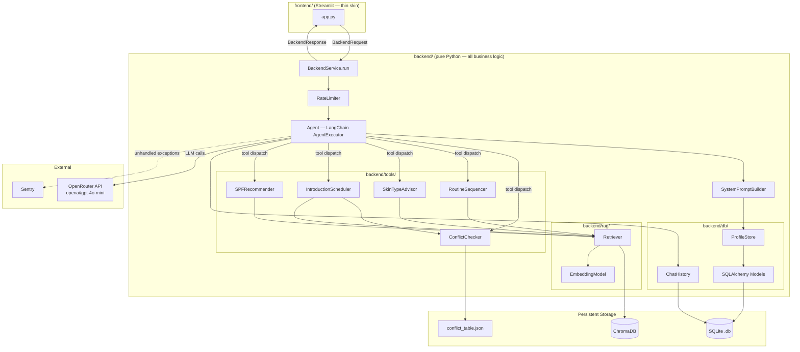
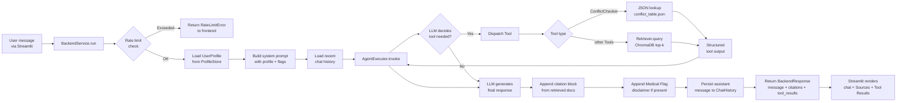
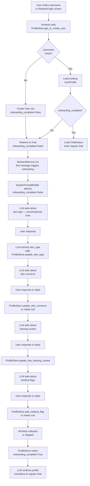
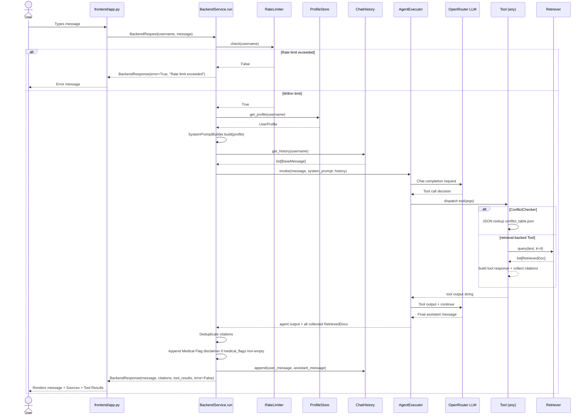
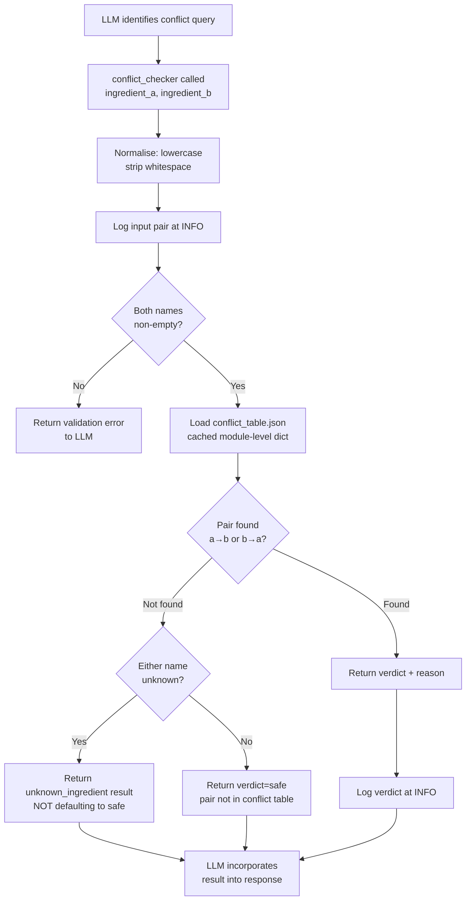
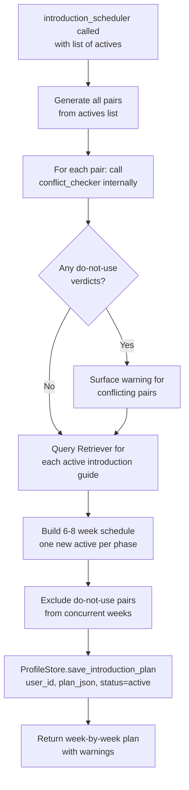

# Design Document — Derma6

## Overview

Derma6 is a conversational RAG assistant for male skincare beginners. It is structured as a monorepo with a pure Python backend and a Streamlit thin-skin frontend. The backend owns all business logic — LangChain agent orchestration, five domain Tools, RAG retrieval via ChromaDB, and User Profile persistence in SQLite. The frontend is a rendering layer only: it calls the backend through a single internal Python API and has no knowledge of LangChain, ChromaDB, or SQLAlchemy.

**Design goals:**

- Enforce the backend / frontend decoupling mandated by ADR-0002 so that swapping Streamlit for FastHTML touches zero domain code.
- Keep the Conflict Checker deterministic via JSON lookup (ADR-0001); all other Tools go through RAG.
- Keep the Knowledge Base scoped to 15–20 whole-document chunks to fit the 2-week timeline.
- Surface citations, tool results, and Medical Flag disclaimers to the user on every applicable response.

---

## Proposed File Structure

```
derma6/
├── backend/
│   ├── __init__.py
│   ├── agent.py                    # LangChain agent, system-prompt builder, run() entry point
│   ├── config.py                   # Typed constants loaded from environment
│   ├── logging_config.py           # Structured logging setup and Sentry init
│   ├── rate_limiter.py             # In-memory sliding-window rate limiter
│   ├── schemas.py                  # Pydantic response/request models (BackendRequest, BackendResponse)
│   ├── tools/
│   │   ├── __init__.py
│   │   ├── conflict_checker.py     # JSON lookup; no RAG
│   │   ├── routine_sequencer.py    # Fixed canonical order; RAG for classification context
│   │   ├── skin_type_advisor.py    # RAG against skin-type guide; writes skin_type to Profile Store
│   │   ├── introduction_scheduler.py  # 6-8 week plan; persists IntroductionPlan
│   │   └── spf_recommender.py      # RAG against SPF docs; enforces SPF 50+ / PA+++ standard
│   ├── rag/
│   │   ├── __init__.py
│   │   ├── retriever.py            # ChromaDB persistent store; top-k similarity; (doc, source_name) pairs
│   │   └── embeddings.py           # Embedding model selection (env-configurable)
│   └── db/
│       ├── __init__.py
│       ├── models.py               # SQLAlchemy ORM models: User, Routine, RoutineStep, IntroductionPlan
│       ├── profile_store.py        # CRUD layer for User Profile and Routines
│       └── chat_history.py         # Thin wrapper around LangChain SQLChatMessageHistory
├── frontend/
│   ├── __init__.py
│   ├── app.py                      # Entry point: authentication gate → redirects to Chat page
│   ├── utils.py                    # inject_css(), shared layout helpers, page header
│   ├── assets/
│   │   └── style.css               # Custom CSS: chat bubbles, verdict badges, card shadows
│   └── pages/
│       ├── 1_Chat.py               # Main conversational interface with Sources + Tool Results expanders
│       ├── 2_My_Profile.py         # Profile summary card: skin type badge, concerns chips, Introduction Plan timeline
│       └── 3_Routine_Viewer.py     # Vertical step-card list for saved Routines
├── knowledge_base/
│   ├── ingredients/
│   │   ├── retinol.md
│   │   ├── niacinamide.md
│   │   ├── vitamin_c.md
│   │   ├── aha_guide.md
│   │   ├── bha_guide.md
│   │   ├── hyaluronic_acid.md
│   │   ├── peptides.md
│   │   ├── ceramides.md
│   │   ├── benzoyl_peroxide.md
│   │   ├── azelaic_acid.md
│   │   └── spf_actives.md
│   ├── guides/
│   │   ├── skin_type_classification.md
│   │   ├── routine_sequencing_rules.md
│   │   ├── common_skincare_mistakes.md
│   │   └── skin_concerns_overview.md
│   └── mens/
│       ├── razor_burn_and_post_shave.md
│       ├── shaving_physiology.md
│       └── beginner_3step_routine.md
├── conflict_table.json             # Conflict pairs: ingredient_a, ingredient_b, verdict, reason
├── scripts/
│   └── index_kb.py                 # One-shot script: embeds knowledge_base/ docs into ChromaDB
├── data/
│   ├── chroma/                     # Persistent ChromaDB storage directory (gitignored)
│   └── skincare.db                 # SQLite Profile Store (gitignored)
├── logs/                           # Log output directory (gitignored)
├── .streamlit/
│   └── config.toml                 # Theme: off-white bg, dark slate text, sage primary, custom font
├── .env.example                    # All required environment variables with placeholder values
├── .env                            # Local secrets (gitignored)
├── .gitignore
├── pyproject.toml                  # Single pyproject.toml for the monorepo (PEP 517)
└── requirements.txt                # Pinned dependencies
```

---

## Architecture

### System Architecture Diagram



### Data Flow Diagram



---

## Component Design

### BackendService (`backend/agent.py`)

**Responsibilities:**
- Expose a single `run(request: BackendRequest) -> BackendResponse` method — the only entry point the frontend calls.
- Check the rate limiter before touching the LLM or any Tool.
- Build the system prompt dynamically from the current User Profile (skin type, concerns, Medical Flags, active Introduction Plan).
- Construct the `AgentExecutor` with all five Tools registered.
- Load recent chat history from `ChatHistory` and include it in the invocation context.
- Collect all (doc, source_name) pairs returned by retrieval-backed Tools during the agent loop.
- Assemble the `BackendResponse` with assistant message, citation list, tool results, and error flag.
- Catch all exceptions at the boundary and return a structured error response; never raise to the frontend.

**Interfaces:**

```python
class BackendRequest(BaseModel):
    username: str
    message: str

class BackendResponse(BaseModel):
    message: str
    citations: list[str]          # Knowledge Base document titles, deduplicated
    tool_results: list[ToolResult]
    error: bool
    error_message: str | None

class ToolResult(BaseModel):
    tool_name: str
    summary: str                   # Short human-readable summary for the UI expander

def run(request: BackendRequest) -> BackendResponse: ...
```

**Dependencies:** `RateLimiter`, `ProfileStore`, `ChatHistory`, all Tools, `logging_config`.

---

### SystemPromptBuilder (`backend/agent.py` — inline function)

**Responsibilities:**
- Produce the full LangChain system prompt string from a User Profile.
- Inject domain constraints (skincare-only, beginner framing, men's grooming focus).
- Inject onboarding-state instructions when the profile is incomplete.
- Inject the Medical Flag disclaimer instruction when `medical_flags` is non-empty.
- Inject tool usage instructions for all five Tools.

**Key prompt sections:**
1. Persona and domain scope (skincare only, male beginners, plain language).
2. Profile summary (skin type, concerns, current Routine steps, Medical Flags).
3. Medical Flag rule: "append the following disclaimer after every response: ...".
4. Onboarding rule: when `onboarding_complete = False`, collect missing fields before giving advice.
5. Citation rule: append `[Source Title, ...]` at the end of every RAG-backed response.
6. Tool descriptions with invocation examples.

---

### RateLimiter (`backend/rate_limiter.py`)

**Responsibilities:**
- Track per-username request timestamps in memory (no external dependency).
- Implement a sliding-window algorithm keyed on `(username, window_seconds)`.
- Expose `check(username: str) -> bool` — returns `True` if the request is allowed.
- Read `RATE_LIMIT_REQUESTS` and `RATE_LIMIT_WINDOW_SECONDS` from `config.py`.

**Interface:**

```python
class RateLimiter:
    def check(self, username: str) -> bool: ...
    def _purge_expired(self, username: str) -> None: ...
```

---

### Tools — ConflictChecker (`backend/tools/conflict_checker.py`)

**Responsibilities:**
- Accept two ingredient names as LangChain tool input.
- Normalise names (lowercase, strip whitespace) before lookup.
- Load `conflict_table.json` once at module import time (cached in a module-level dict).
- Look up the pair with both orderings (a→b and b→a).
- Return a `ConflictResult` with `verdict` (`safe` | `use-at-different-times` | `do-not-use`), `reason`, and `unknown_ingredients` list.
- Log input pair and verdict at INFO level.
- Validate that both ingredient strings are non-empty; return a structured validation error if not.

**Interface:**

```python
@tool
def conflict_checker(ingredient_a: str, ingredient_b: str) -> str:
    """Check whether two skincare ingredients are safe to combine."""
    ...
```

**Does not** call the Retriever. Reads `conflict_table.json` only.

---

### Tools — RoutineSequencer (`backend/tools/routine_sequencer.py`)

**Responsibilities:**
- Accept a list of ingredient/product names as LangChain tool input.
- Apply the fixed canonical step order: cleanser → toner → serum → moisturiser → SPF.
- Use a hardcoded classification map (ingredient → canonical step) as the primary lookup.
- Call the Retriever with query `"routine sequencing rules application order"` for any ingredient that cannot be classified by the map, to provide the LLM with context.
- Return an ordered list of steps; flag unclassifiable items explicitly.
- Does not persist to the Profile Store (that is done by the agent when the user confirms their Routine).

---

### Tools — SkinTypeAdvisor (`backend/tools/skin_type_advisor.py`)

**Responsibilities:**
- Accept a free-text description of the user's skin as LangChain tool input.
- Call the Retriever with query `"skin type classification {description}"` against the Knowledge Base.
- Classify into one of: oily, dry, combination, sensitive, dehydrated, acneic.
- Persist the result to `ProfileStore.update_skin_type(username, skin_type)`.
- Return classification with distinguishing characteristics.
- If confidence is low (no retrieved documents above threshold), return a clarifying-question response instead of a speculative verdict.

---

### Tools — IntroductionScheduler (`backend/tools/introduction_scheduler.py`)

**Responsibilities:**
- Accept a list of actives to introduce and the username as LangChain tool input.
- Call `ConflictChecker` for every pair of actives to surface `do-not-use` conflicts before scheduling.
- Call the Retriever for each active to gather introduction-rate guidance from the Knowledge Base.
- Generate a 6–8 week phased plan, one new active per phase, respecting conflict verdicts.
- Persist the resulting `IntroductionPlan` to the Profile Store.
- Return the plan as a structured week-by-week list with warnings for any conflicting pairs.

---

### Tools — SPFRecommender (`backend/tools/spf_recommender.py`)

**Responsibilities:**
- Accept a user query string as LangChain tool input.
- Call the Retriever with query `"SPF sunscreen UV protection"`.
- Enforce the SPF Standard: only recommend SPF 50+ / PA+++ formulations.
- If the user requests SPF 30, explain the SPF Standard and decline to endorse a lower level.
- Return recommendation with citations from retrieved documents.

---

### Retriever (`backend/rag/retriever.py`)

**Responsibilities:**
- Initialise a persistent ChromaDB client pointed at `CHROMA_PERSIST_DIR`.
- On first use, detect if the collection is empty and raise `EmptyCollectionError` (the agent catches this and instructs the user to run `scripts/index_kb.py`).
- Expose `query(text: str, k: int) -> list[RetrievedDoc]` for similarity search.
- Return `RetrievedDoc(content: str, source_name: str, score: float)` tuples.
- Apply a minimum similarity threshold (`RETRIEVAL_MIN_SCORE` from config); omit documents below it.
- Log query, retrieved count, and source names at DEBUG level.

**Interface:**

```python
@dataclass
class RetrievedDoc:
    content: str
    source_name: str      # maps to Knowledge Base document title metadata
    score: float

class Retriever:
    def query(self, text: str, k: int = 4) -> list[RetrievedDoc]: ...
```

---

### ProfileStore (`backend/db/profile_store.py`)

**Responsibilities:**
- Own all CRUD operations against the SQLite Profile Store.
- Expose a clean interface independent of SQLAlchemy internals — callers receive plain dataclasses/Pydantic models, not ORM objects.
- Create tables on first run (via `Base.metadata.create_all`).
- Provide `get_or_create_user`, `update_skin_type`, `update_skin_concerns`, `update_has_shaving_routine`, `add_medical_flag`, `get_profile`, `save_routine`, `get_routine`, `save_introduction_plan`, `get_introduction_plan`.
- Mark `onboarding_complete = True` when all required onboarding fields have been collected.
- Catch SQLAlchemy exceptions, log them, and re-raise as `ProfileStoreError` so callers can present a safe fallback.

---

### ChatHistory (`backend/db/chat_history.py`)

**Responsibilities:**
- Wrap LangChain's `SQLChatMessageHistory` keyed on `session_id = username`.
- Expose `get_history(username: str) -> BaseChatMessageHistory` for use in the agent executor.
- Expose `clear(username: str)` for test / admin use.

---

### Streamlit App (`frontend/app.py`)

**Responsibilities:**
- Manage Streamlit `st.session_state` for `username` and `authenticated` flag only — no business logic state.
- **Login screen:** text input + submit; validate non-empty, non-whitespace; call `ProfileStore.get_or_create_user` to determine if onboarding is needed; store `username` in session state.
- **Chat interface:** display existing chat history via `st.chat_message`; accept new input via `st.chat_input`; show `st.spinner` while backend processes; render `BackendResponse`.
- **Response rendering:**
  - Main message in the assistant chat bubble.
  - `st.expander("Sources")` if `citations` is non-empty.
  - `st.expander("Tool Results")` if `tool_results` is non-empty.
  - Inline warning box if `error = True`.
- Import `from backend.agent import BackendService` — the only cross-layer import.

---

### Indexing Script (`scripts/index_kb.py`)

**Responsibilities:**
- Load all `.md` files from `knowledge_base/` recursively.
- Extract title from the first `# ` heading of each file.
- Assign `topic_category` from the subdirectory name (`ingredients`, `guides`, `mens`).
- Embed each document as a single chunk using the configured embedding model.
- Upsert into the ChromaDB collection with metadata: `{"source_name": title, "topic_category": category, "file_path": path}`.
- Log progress and a final count summary.
- Idempotent: re-running it upserts without duplicating.

---

## Data Models

### SQLAlchemy ORM Models (`backend/db/models.py`)

```python
class User(Base):
    __tablename__ = "users"

    id: Mapped[int]            # primary key
    username: Mapped[str]      # unique, not null
    skin_type: Mapped[str | None]
    skin_concerns: Mapped[str | None]   # JSON-serialised list[str]
    has_shaving_routine: Mapped[bool | None]
    medical_flags: Mapped[str | None]   # JSON-serialised list[str]
    onboarding_complete: Mapped[bool]   # default False
    created_at: Mapped[datetime]
    updated_at: Mapped[datetime]

class Routine(Base):
    __tablename__ = "routines"

    id: Mapped[int]
    user_id: Mapped[int]        # FK → users.id
    name: Mapped[str]           # "Morning", "Evening", "Travel"
    created_at: Mapped[datetime]
    updated_at: Mapped[datetime]

class RoutineStep(Base):
    __tablename__ = "routine_steps"

    id: Mapped[int]
    routine_id: Mapped[int]     # FK → routines.id
    position: Mapped[int]       # 1-based canonical order
    ingredient: Mapped[str]     # required; canonical ingredient name
    product_name: Mapped[str | None]    # nullable; reserved for v2

class IntroductionPlan(Base):
    __tablename__ = "introduction_plans"

    id: Mapped[int]
    user_id: Mapped[int]        # FK → users.id
    plan_json: Mapped[str]      # JSON-serialised list[IntroductionWeek]
    actives_list: Mapped[str]   # JSON-serialised list[str] of actives being introduced
    created_at: Mapped[datetime]
    updated_at: Mapped[datetime]
    status: Mapped[str]         # "active" | "completed" | "paused"
```

### Application-layer Pydantic Models (`backend/schemas.py`)

```python
class UserProfile(BaseModel):
    username: str
    skin_type: str | None
    skin_concerns: list[str]
    has_shaving_routine: bool | None
    medical_flags: list[str]
    onboarding_complete: bool

class RoutineStepSchema(BaseModel):
    position: int
    ingredient: str
    product_name: str | None = None

class RoutineSchema(BaseModel):
    name: str
    steps: list[RoutineStepSchema]

class IntroductionWeek(BaseModel):
    week: int
    active: str
    frequency: str          # e.g. "2x per week"
    notes: str

class IntroductionPlanSchema(BaseModel):
    actives: list[str]
    weeks: list[IntroductionWeek]
    status: str

class BackendRequest(BaseModel):
    username: str
    message: str

class BackendResponse(BaseModel):
    message: str
    citations: list[str]
    tool_results: list[ToolResult]
    error: bool
    error_message: str | None = None

class ToolResult(BaseModel):
    tool_name: str
    summary: str
```

### Conflict Table Schema (`conflict_table.json`)

```json
{
  "pairs": [
    {
      "ingredient_a": "retinol",
      "ingredient_b": "vitamin_c",
      "verdict": "use-at-different-times",
      "reason": "Both are active at different pH ranges and combined use increases irritation risk. Use vitamin C in the morning and retinol in the evening."
    }
  ]
}
```

Each pair is stored once. The Conflict Checker normalises both orderings before lookup. The `verdict` field is one of: `"safe"`, `"use-at-different-times"`, `"do-not-use"`.

---

## Business Process

### Process 1: First-Time User Onboarding Flow



**Onboarding field collection order:** skin type → skin concerns → has_shaving_routine → medical_flags.

The LLM is instructed in the system prompt to collect one field per turn, persist it immediately, and proceed to the next. If a user skips a question, the LLM marks the field null and moves on. The fixed field set is enforced by the system prompt; only the phrasing varies.

---

### Process 2: Regular Chat Request Lifecycle



---

### Process 3: Conflict Checker Tool Invocation



---

### Process 4: Introduction Scheduler Conflict-Aware Planning



---

## Onboarding Flow State Machine

The Onboarding Flow is managed via the system prompt, not a separate code state machine. The `onboarding_complete` flag on the `User` model drives the system prompt variant injected into the LLM.

| State | Condition | System Prompt Behaviour |
|---|---|---|
| `needs_onboarding` | `onboarding_complete = False` | LLM instructed to collect missing fields in order; no advice until complete |
| `collecting_skin_type` | `skin_type IS NULL` | Ask skin type question; persist result; move to next field |
| `collecting_concerns` | `skin_concerns IS NULL` | Ask concerns question; persist result; move to next field |
| `collecting_shaving` | `has_shaving_routine IS NULL` | Ask shaving question; persist result; move to next field |
| `collecting_flags` | `medical_flags IS NULL` | Ask medical flags question; persist result; mark `onboarding_complete = True` |
| `onboarded` | `onboarding_complete = True` | Full assistant persona; all Tools available; Citations active |

The system prompt communicates the current missing fields by inspecting the `UserProfile` in `SystemPromptBuilder.build()`. LangChain's function-calling interface is used to allow the LLM to trigger profile update operations during onboarding as dedicated lightweight tool calls (`update_skin_type`, `update_skin_concerns`, etc.) or via post-processing the assistant response before persisting.

**Design decision:** Profile updates during onboarding are performed by the backend immediately after each LLM turn, not deferred to the end of onboarding. This means a user who drops off mid-onboarding resumes from the last collected field.

---

## Knowledge Base Document List

18 documents total, stored as whole-document chunks. Each document becomes exactly one ChromaDB vector.

### Ingredients (11 documents)

| File | Title | Topic Category |
|---|---|---|
| `ingredients/retinol.md` | Retinol Profile | ingredients |
| `ingredients/niacinamide.md` | Niacinamide Profile | ingredients |
| `ingredients/vitamin_c.md` | Vitamin C Profile | ingredients |
| `ingredients/aha_guide.md` | AHA Guide | ingredients |
| `ingredients/bha_guide.md` | BHA Guide | ingredients |
| `ingredients/hyaluronic_acid.md` | Hyaluronic Acid Profile | ingredients |
| `ingredients/peptides.md` | Peptides Profile | ingredients |
| `ingredients/ceramides.md` | Ceramides Profile | ingredients |
| `ingredients/benzoyl_peroxide.md` | Benzoyl Peroxide Profile | ingredients |
| `ingredients/azelaic_acid.md` | Azelaic Acid Profile | ingredients |
| `ingredients/spf_actives.md` | SPF Actives Guide | ingredients |

### Guides (4 documents)

| File | Title | Topic Category |
|---|---|---|
| `guides/skin_type_classification.md` | Skin Type Classification Guide | guides |
| `guides/routine_sequencing_rules.md` | Routine Sequencing Rules | guides |
| `guides/common_skincare_mistakes.md` | Common Skincare Mistakes | guides |
| `guides/skin_concerns_overview.md` | Skin Concerns Overview | guides |

### Men-Specific (3 documents)

| File | Title | Topic Category |
|---|---|---|
| `mens/razor_burn_and_post_shave.md` | Razor Burn and Post-Shave Barrier Repair | mens |
| `mens/shaving_physiology.md` | Shaving Physiology | mens |
| `mens/beginner_3step_routine.md` | Beginner 3-Step Routine for Men | mens |

**Note:** `conflict_table.json` is not a Knowledge Base document and is not embedded into ChromaDB. It is read directly by the Conflict Checker Tool.

---

## Error Handling Strategy

### LLM Call Failure

- **Catch:** `openai.APIConnectionError`, `openai.RateLimitError`, `openai.APIStatusError` (all routed through LangChain's OpenAI-compatible adapter).
- **Action:** Log at ERROR level with full stack trace. Return `BackendResponse(error=True, error_message="The assistant is temporarily unavailable. Please try again in a moment.")`.
- **User impact:** Safe error message displayed in Streamlit; session not lost; retry is possible.

### ChromaDB Retrieval Failure

- **Catch:** Any exception from `chromadb` client or `Retriever.query`.
- **Action:** Log at ERROR level. Tool returns a structured error string to the LLM instructing it to respond without RAG context. LLM response acknowledges knowledge base unavailability.
- **User impact:** Response delivered without citations; user informed knowledge base is temporarily unavailable.

### SQLite / Profile Store Failure

- **Catch:** `sqlalchemy.exc.SQLAlchemyError`, re-raised as `ProfileStoreError`.
- **Action:** Log at ERROR level. Backend continues with in-memory `UserProfile` state for the current request. Inform user in the chat response that data persistence is temporarily unavailable.
- **User impact:** Conversation continues; changes to profile may not be saved.

### Tool Validation Failure

- **Catch:** Pydantic `ValidationError` on tool input parsing.
- **Action:** Tool returns a structured error string to the LLM (`"Tool input validation failed: <field> is required"`). LLM re-prompts the user for clarification.
- **User impact:** LLM asks for missing or malformed input; no crash.

### Unhandled Tool Exception

- **Catch:** Bare `except Exception` at the `@tool` function boundary.
- **Action:** Log at ERROR level with tool name, input, and stack trace. Return `"Tool execution failed. The assistant will answer without this tool's output."` to the LLM.
- **User impact:** LLM continues without the Tool result; Sentry captures the exception.

### Rate Limit Exceeded

- **Action:** Return `BackendResponse(error=True, error_message="You are sending messages too quickly. Please wait a moment before trying again.")` immediately.
- **User impact:** Message displayed in Streamlit; no LLM call made.

### Missing Environment Variables at Startup

- **Action:** `config.py` validates all required variables using a Pydantic `BaseSettings` model on import. Missing variables raise `ValidationError` immediately at startup, printing a clear list of missing variables. Application does not start.

---

## Logging Strategy

### Initialisation (`backend/logging_config.py`)

```python
# Structured logging via Python standard logging module
# Format: ISO timestamp | LEVEL | component | message | (optional JSON extras)
# Output: stdout + rotating file handler writing to logs/app.log
# Sentry SDK: initialised once at startup if SENTRY_DSN env var is set

def setup_logging() -> None:
    """Call once at application entry points (agent.py import, app.py startup)."""
    ...

def init_sentry() -> None:
    """
    If SENTRY_DSN is set: initialise Sentry SDK with traces_sample_rate from config.
    If SENTRY_DSN is not set: log a WARNING and skip — no error raised.
    Call once at startup only.
    """
    ...
```

### Per-Component Log Events

| Component | Event | Level | Fields |
|---|---|---|---|
| `BackendService` | Request received | DEBUG | username, message_length |
| `BackendService` | Rate limit exceeded | WARNING | username |
| `BackendService` | Agent invocation start | DEBUG | username |
| `BackendService` | Agent invocation complete | INFO | username, citations_count, tool_names |
| `BackendService` | Unhandled boundary exception | ERROR | username, exc_type, stack_trace |
| `RateLimiter` | Request allowed | DEBUG | username, window_count |
| `RateLimiter` | Request blocked | WARNING | username, window_count, limit |
| `Retriever` | Query issued | DEBUG | query_text, k |
| `Retriever` | Documents retrieved | DEBUG | doc_count, source_names, scores |
| `Retriever` | No documents above threshold | WARNING | query_text, threshold |
| `ConflictChecker` | Pair looked up | INFO | ingredient_a, ingredient_b, verdict |
| `ConflictChecker` | Unknown ingredient | WARNING | ingredient_name |
| `ProfileStore` | User created | INFO | username |
| `ProfileStore` | Profile updated | DEBUG | username, field, value |
| `ProfileStore` | DB error | ERROR | operation, exc_type, stack_trace |
| `ChatHistory` | History loaded | DEBUG | username, message_count |
| `LLM call` (via LangChain callback) | Call made | DEBUG | model, prompt_tokens, completion_tokens |
| Any Tool | Tool invoked | INFO | tool_name, input_args |
| Any Tool | Tool completed | INFO | tool_name, output_summary |
| Any Tool | Tool exception | ERROR | tool_name, input_args, exc_type, stack_trace |

---

## Rate Limiting

**Implementation:** In-memory sliding-window per username, implemented in `backend/rate_limiter.py`. No external dependency (no Redis required for v1).

**Algorithm:**
1. Maintain a `dict[str, deque[float]]` mapping `username → deque of request timestamps`.
2. On each call to `check(username)`: purge timestamps older than `RATE_LIMIT_WINDOW_SECONDS` from the deque.
3. If `len(deque) >= RATE_LIMIT_REQUESTS`: return `False` (blocked).
4. Append `time.monotonic()` to the deque; return `True` (allowed).
5. The deque is bounded to `RATE_LIMIT_REQUESTS` max size to prevent memory growth.

**Configuration (from `config.py`):**

| Variable | Default | Description |
|---|---|---|
| `RATE_LIMIT_REQUESTS` | `10` | Max requests allowed in the window |
| `RATE_LIMIT_WINDOW_SECONDS` | `60` | Sliding window duration in seconds |

**Limitation:** Resets on process restart (in-memory). Sufficient for the 2-week sprint; a Redis-backed implementation is a v2 upgrade.

---

## Configuration

### Environment Variables (`.env.example`)

```dotenv
# ── LLM ──────────────────────────────────────────────────────────────────────
OPENROUTER_API_KEY=your_openrouter_api_key_here
LLM_MODEL=openai/gpt-4o-mini
OPENROUTER_BASE_URL=https://openrouter.ai/api/v1

# ── Embeddings ────────────────────────────────────────────────────────────────
EMBEDDING_MODEL=qwen/qwen3-embedding-8b

# ── Storage ───────────────────────────────────────────────────────────────────
SQLITE_DB_PATH=./data/skincare.db
CHROMA_PERSIST_DIR=./data/chroma
CONFLICT_TABLE_PATH=./conflict_table.json

# ── Retrieval ─────────────────────────────────────────────────────────────────
RETRIEVAL_TOP_K=4
RETRIEVAL_MIN_SCORE=0.3

# ── Rate Limiting ─────────────────────────────────────────────────────────────
RATE_LIMIT_REQUESTS=10
RATE_LIMIT_WINDOW_SECONDS=60

# ── Input Validation ──────────────────────────────────────────────────────────
MAX_MESSAGE_CHARS=2000

# ── Logging ───────────────────────────────────────────────────────────────────
LOG_LEVEL=INFO
LOG_FILE=./logs/app.log

# ── Error Monitoring (optional) ───────────────────────────────────────────────
SENTRY_DSN=
SENTRY_TRACES_SAMPLE_RATE=0.1
```

### Config Module (`backend/config.py`)

```python
from pydantic_settings import BaseSettings

class Settings(BaseSettings):
    openrouter_api_key: str
    llm_model: str = "openai/gpt-4o-mini"
    openrouter_base_url: str = "https://openrouter.ai/api/v1"
    embedding_model: str = "qwen/qwen3-embedding-8b"
    sqlite_db_path: str = "./data/skincare.db"
    chroma_persist_dir: str = "./data/chroma"
    conflict_table_path: str = "./conflict_table.json"
    retrieval_top_k: int = 4
    retrieval_min_score: float = 0.3
    rate_limit_requests: int = 10
    rate_limit_window_seconds: int = 60
    max_message_chars: int = 2000
    log_level: str = "INFO"
    log_file: str = "./logs/app.log"
    sentry_dsn: str = ""
    sentry_traces_sample_rate: float = 0.1

    class Config:
        env_file = ".env"

settings = Settings()
```

Validation is automatic on import: a missing required variable (`openrouter_api_key`) raises `pydantic_settings.ValidationError` immediately with a clear field-level message.

---

## Testing Strategy

### Unit Tests

Each component is tested in isolation with mocked dependencies.

| Target | What is tested |
|---|---|
| `conflict_checker` | Known pairs (both orderings), unknown ingredient, empty input, do-not-use verdict |
| `routine_sequencer` | Canonical order output, unclassifiable ingredient flagging, empty input |
| `skin_type_advisor` | Classification output, clarifying-question path when no docs retrieved |
| `spf_recommender` | SPF 50+ enforcement, low-SPF refusal path |
| `introduction_scheduler` | Pair conflict detection, plan structure (6–8 weeks), do-not-use exclusion |
| `retriever` | Top-k results, min-score filtering, empty-collection error |
| `profile_store` | Create user, get profile, update fields, null field tolerance, error propagation |
| `rate_limiter` | Allow within window, block when exceeded, window expiry, per-user isolation |
| `system_prompt_builder` | Onboarding variant, Medical Flag injection, onboarded variant |

### Integration Tests

| Scenario | What is tested |
|---|---|
| Full onboarding flow | New username → onboarding turn sequence → `onboarding_complete = True` in SQLite |
| Conflict Checker in agent loop | User asks about retinol + vitamin C → agent invokes ConflictChecker → response contains verdict |
| RAG citation | User asks about retinol → retriever returns doc → response contains `[Retinol Profile]` |
| Rate limit enforcement | 11th request from same username within 60s → `error=True` response |
| Missing env var at startup | Unset `OPENROUTER_API_KEY` → `ValidationError` raised before any request served |

### Test Infrastructure

- Framework: `pytest`
- Fixtures: in-memory SQLite for Profile Store tests; mock ChromaDB client; mock OpenRouter responses via `unittest.mock`
- No live LLM or ChromaDB calls in unit tests
- Integration tests may use a real SQLite file in a temp directory

---

## Key Design Decisions

**1. Whole-document chunking.** Each Knowledge Base document is embedded as one chunk. This avoids boundary effects at the cost of slightly larger context windows per retrieved document. Given the Knowledge Base is capped at 18 documents, retrieved context remains manageable.

**2. Conflict Checker reads JSON, not ChromaDB.** Per ADR-0001: ingredient conflicts are finite and enumerable. Determinism is more important than flexibility for safety-relevant verdicts. The JSON file is loaded once at module import time.

**3. Backend as the single source of truth.** Per ADR-0002: all state transitions, profile writes, and LLM calls happen in the backend. Streamlit holds only `username` and `authenticated` in session state. Frontend replacement is a matter of swapping `frontend/app.py`.

**4. Pydantic `BaseSettings` for config.** Fail-fast on missing required variables at import time. No configuration errors surface at request time.

**5. In-memory rate limiter for v1.** Avoids Redis dependency. Trade-off accepted: limits reset on restart. Documented as a v2 upgrade path.

**6. Sentry initialised once at startup.** `init_sentry()` is called once during module load in `logging_config.py`. All unhandled exceptions propagate to Sentry automatically via the SDK's default integration. No per-exception instrumentation needed.

**7. Onboarding managed via system prompt, not a separate state machine.** The `SystemPromptBuilder` reads the current profile fields and injects the appropriate onboarding instruction. This keeps the state representation in the Profile Store (the single source of truth) rather than duplicated in Python.
