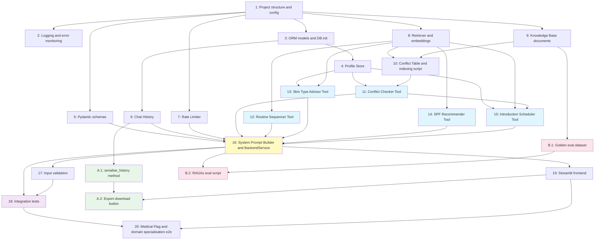

# Implementation Plan — Skincare Routine Builder

## Overview

This plan converts the approved design into an ordered sequence of coding tasks. Each task is scoped to a single component or concern, builds on the previous step, and ends with the system fully wired together. Optional tasks (RAGAs evaluation, conversation export) are placed at the end and clearly marked.

---

- [ ] 1. Set up project structure and configuration foundation
  - Create the monorepo directory layout: `backend/`, `backend/tools/`, `backend/rag/`, `backend/db/`, `frontend/`, `knowledge_base/ingredients/`, `knowledge_base/guides/`, `knowledge_base/mens/`, `scripts/`, `data/`, `logs/`
  - Write `pyproject.toml` with all required dependencies pinned (langchain, langchain-community, chromadb, sqlalchemy, pydantic-settings, streamlit, openai, python-dotenv, pytest, sentry-sdk, ragas, httpx)
  - Write `requirements.txt` as a flat export for environments that prefer pip
  - Write `.env.example` with all required variables and placeholder values
  - Write `.gitignore` excluding `.env`, `data/`, `logs/`, `__pycache__/`, `.pytest_cache/`
  - Write `backend/config.py` using `pydantic_settings.BaseSettings`; validate all required variables at import time; fail fast with a clear field-level message if any are missing
  - Write `__init__.py` files for `backend/`, `backend/tools/`, `backend/rag/`, `backend/db/`, `frontend/`
  - _Requirements: 23.1, 23.2, 23.3, 25.1_

- [ ] 2. Implement logging and error monitoring
  - Write `backend/logging_config.py` with `setup_logging()` (stdout + rotating file handler, ISO timestamp format) and `init_sentry()` (reads `SENTRY_DSN`; logs a WARNING and skips if not set; initialises Sentry SDK if set; called once at startup)
  - Ensure `setup_logging()` and `init_sentry()` are called at module import in `backend/agent.py` and at app startup in `frontend/app.py`
  - Write a unit test that verifies `init_sentry()` does not raise when `SENTRY_DSN` is absent
  - Write a unit test that verifies `init_sentry()` does not re-initialise on repeated calls (idempotency)
  - _Requirements: 19.1, 19.4, 19.6, 26.1, 26.2, 26.3, 26.4, 26.5_

- [ ] 3. Implement SQLAlchemy ORM models and database initialisation
  - Write `backend/db/models.py` with `User`, `Routine`, `RoutineStep`, and `IntroductionPlan` SQLAlchemy ORM classes (mapped columns, relationships, created_at/updated_at defaults)
  - Store `skin_concerns` and `medical_flags` as JSON-serialised strings; `onboarding_complete` defaults to `False`
  - Call `Base.metadata.create_all(engine)` on first import so tables are created automatically
  - Write unit tests: create all four tables in an in-memory SQLite database; assert all columns exist with correct types and nullable constraints
  - _Requirements: 3.1, 3.2, 3.6, 4.1_

- [ ] 4. Implement the Profile Store
  - Write `backend/db/profile_store.py` with `ProfileStoreError` exception class and `ProfileStore` CRUD class
  - Implement: `get_or_create_user(username)`, `get_profile(username) -> UserProfile`, `update_skin_type`, `update_skin_concerns`, `update_has_shaving_routine`, `add_medical_flag`, `save_routine`, `get_routine`, `save_introduction_plan`, `get_introduction_plan`
  - Callers receive plain Pydantic/dataclass objects, never ORM objects
  - Mark `onboarding_complete = True` when all four required fields are non-null
  - Catch `SQLAlchemyError`, log at ERROR level, re-raise as `ProfileStoreError`
  - Write unit tests for each method using an in-memory SQLite database: create user, load existing user, update each field individually, null field tolerance (no crash when a field is absent), `ProfileStoreError` propagation
  - _Requirements: 2.1, 2.2, 2.3, 3.1, 3.2, 3.3, 3.4, 3.5, 5.4, 18.4_

- [ ] 5. Implement the Pydantic application-layer schemas
  - Write `backend/schemas.py` with all Pydantic models: `UserProfile`, `RoutineStepSchema`, `RoutineSchema`, `IntroductionWeek`, `IntroductionPlanSchema`, `BackendRequest`, `BackendResponse`, `ToolResult`
  - `BackendRequest` validates `username` is non-empty and non-whitespace; `message` is non-empty and does not exceed `MAX_MESSAGE_CHARS`
  - Write unit tests: valid `BackendRequest`, username whitespace rejection, message length rejection, `BackendResponse` with and without citations and tool results
  - _Requirements: 1.3, 17.1, 17.3_

- [ ] 6. Implement Chat History
  - Write `backend/db/chat_history.py` wrapping LangChain `SQLChatMessageHistory`
  - Expose `get_history(username: str) -> BaseChatMessageHistory` keyed on `session_id = username`
  - Expose `clear(username: str)` for test use
  - Write unit tests: append and retrieve messages, empty history returns no error, clear removes messages
  - _Requirements: 4.1, 4.2, 4.3, 4.4_

- [ ] 7. Implement the Rate Limiter
  - Write `backend/rate_limiter.py` with `RateLimiter` class implementing a sliding-window algorithm using a `dict[str, deque[float]]`
  - Implement `check(username: str) -> bool` and `_purge_expired(username: str)`
  - Read `RATE_LIMIT_REQUESTS` and `RATE_LIMIT_WINDOW_SECONDS` from `settings` in `config.py`
  - Write unit tests: allow requests within window, block on the configured limit, unblock after window expires, verify per-user isolation
  - _Requirements: 20.1, 20.2, 20.3, 20.4_

- [ ] 8. Implement the Retriever and embedding model
  - Write `backend/rag/embeddings.py` implementing an **API-based embedding client** for `qwen/qwen3-embedding-8b` via OpenRouter's embeddings endpoint (`POST /api/v1/embeddings`); use `httpx` for the request; wrap in a LangChain-compatible `Embeddings` interface so ChromaDB and the indexing script consume it transparently. Set `EMBEDDING_MODEL=qwen/qwen3-embedding-8b` as the default in `.env.example` and `config.py`. Note: this is not a locally-loaded sentence-transformers model — it is an API call using `OPENROUTER_API_KEY`.
  - Write `backend/rag/retriever.py` with `RetrievedDoc` dataclass (`content`, `source_name`, `score`) and `Retriever` class
  - Implement `query(text: str, k: int = 4) -> list[RetrievedDoc]`: similarity search against the persistent ChromaDB collection, filter by `RETRIEVAL_MIN_SCORE`
  - Raise `EmptyCollectionError` if the ChromaDB collection is empty at query time
  - Log query, retrieved count, and source names at DEBUG level; log a WARNING if no documents pass the threshold
  - Write unit tests using a mock ChromaDB client: top-k results returned, documents below threshold excluded, `EmptyCollectionError` raised on empty collection
  - _Requirements: 6.2, 6.3, 7.1, 7.4, 7.5, 18.3_

- [ ] 9. Research and write Knowledge Base first drafts
  - **9a. Research (ingredients):** For each of the 11 ingredient docs, run targeted web searches against authoritative sources (PubMed abstracts, Paula's Choice Ingredient Dictionary, INCIDecoder, AAD guidelines). Collect: mechanism of action, skin benefits, usage frequency/concentration, key cautions, and interaction notes. Record source URLs alongside each doc for the refinement pass.
  - **9b. Research (guides + men-specific):** For the 4 guide docs and 3 men-specific docs, gather content from AAD, dermatology literature, and men's grooming references (shaving physiology, razor burn treatment). Same source-URL annotation requirement.
  - **9c. Write first drafts:** Author all 18 `.md` files from the research above. Each file must start with a `# Title` heading matching the design's Knowledge Base table. Content must be accurate enough for RAG retrieval to return useful context; it is explicitly a first draft — a deeper user-led refinement pass is planned after the system is running end-to-end.
  - Ingredients (11): `retinol.md`, `niacinamide.md`, `vitamin_c.md`, `aha_guide.md`, `bha_guide.md`, `hyaluronic_acid.md`, `peptides.md`, `ceramides.md`, `benzoyl_peroxide.md`, `azelaic_acid.md`, `spf_actives.md`
  - Guides (4): `skin_type_classification.md`, `routine_sequencing_rules.md`, `common_skincare_mistakes.md`, `skin_concerns_overview.md`
  - Men-specific (3): `razor_burn_and_post_shave.md`, `shaving_physiology.md`, `beginner_3step_routine.md`
  - _Requirements: 6.1, 6.5_

- [ ] 10. Curate Conflict Table and implement the indexing script
  - **10a. Curate conflict pairs:** Research ingredient interactions from authoritative sources (INCIDecoder, Paula's Choice, peer-reviewed dermatology literature). Establish verdicts for at minimum: retinol/vitamin C, retinol/AHA, retinol/BHA, benzoyl peroxide/retinol, benzoyl peroxide/vitamin C, AHA/BHA same-time caution, niacinamide/vitamin C (timing), retinol/benzoyl peroxide. Each pair must have a sourced `reason`; mark pairs as `safe`, `use-at-different-times`, or `do-not-use`.
  - **10b. Write `conflict_table.json`** from the curated pairs; each entry must have `ingredient_a`, `ingredient_b`, `verdict`, `reason`. Additional pairs can be added during the KB refinement pass.
  - Write `scripts/index_kb.py`: load all `.md` files from `knowledge_base/` recursively, extract `source_name` from the first `# ` heading, assign `topic_category` from the subdirectory name, embed each document as a single chunk, upsert into ChromaDB with metadata, log progress and a final count summary; script must be idempotent
  - Write a test that runs the indexing script against a temp ChromaDB directory and verifies all 18 documents are present with correct metadata
  - _Requirements: 6.1, 6.2, 6.3, 6.4, 6.5, 8.3_

- [ ] KB-REFINE. Knowledge Base refinement pass _(user-led, after system is running end-to-end)_
  - Review each of the 18 `.md` first drafts against the annotated source URLs; deepen content, correct any inaccuracies, and expand thin sections
  - Add additional conflict pairs to `conflict_table.json` as needed
  - Re-run `scripts/index_kb.py` to re-index the updated documents into ChromaDB
  - _This task is intentionally deferred — execute only after task 20 (end-to-end system) is complete_

- [ ] 11. Implement the Conflict Checker Tool
  - Write `backend/tools/conflict_checker.py` with the `conflict_checker` LangChain `@tool` function
  - Load `conflict_table.json` once at module import time into a module-level dict; normalise keys to lowercase with whitespace stripped; look up pairs in both orderings
  - Return a verdict string (`safe` | `use-at-different-times` | `do-not-use`), reason, and unknown ingredients list
  - If an ingredient is not in the table, return an explicit `unknown_ingredient` result — never default to `safe`
  - Validate both input strings are non-empty; return a structured validation error string if not
  - Log input pair and verdict at INFO level; log unknown ingredients at WARNING
  - Write unit tests: known safe pair, known `use-at-different-times` pair, known `do-not-use` pair, both orderings return the same result, unknown ingredient, empty input validation error
  - _Requirements: 8.1, 8.2, 8.3, 8.4, 8.5, 8.6, 16.2, 16.4, 17.2, 17.4_

- [ ] 12. Implement the Routine Sequencer Tool
  - Write `backend/tools/routine_sequencer.py` with the `routine_sequencer` LangChain `@tool` function
  - Accept a comma-separated list of ingredient/product names as input
  - Apply the fixed canonical step order: cleanser → toner → serum → moisturiser → SPF using a hardcoded classification map
  - Call `Retriever.query("routine sequencing rules application order")` for any ingredient not classified by the map
  - Return the ordered step list; flag unclassifiable items explicitly
  - Wrap in a bare `except Exception` guard; log at ERROR and return a graceful fallback string on failure
  - Write unit tests (mock Retriever): canonical order output for known ingredients, unclassifiable ingredient flagged, empty input handled
  - _Requirements: 9.1, 9.2, 9.3, 9.4, 9.5, 16.2, 16.4, 17.2, 18.2_

- [ ] 13. Implement the Skin Type Advisor Tool
  - Write `backend/tools/skin_type_advisor.py` with the `skin_type_advisor` LangChain `@tool` function
  - Accept a free-text description and `username` as input; call `Retriever.query(f"skin type classification {description}")`
  - Classify into: oily, dry, combination, sensitive, dehydrated, or acneic; include distinguishing characteristics
  - If no documents are retrieved above threshold, return a clarifying-question response instead of a speculative verdict
  - On successful classification, call `ProfileStore.update_skin_type(username, skin_type)`
  - Write unit tests (mock Retriever and ProfileStore): classification returned and persisted, clarifying question when no docs retrieved, ProfileStore called with correct arguments
  - _Requirements: 10.1, 10.2, 10.3, 10.4, 10.5, 16.2, 16.4, 17.2, 18.2_

- [ ] 14. Implement the SPF Recommender Tool
  - Write `backend/tools/spf_recommender.py` with the `spf_recommender` LangChain `@tool` function
  - Accept a user query string; call `Retriever.query("SPF sunscreen UV protection")`
  - Enforce the SPF Standard: only recommend SPF 50+ / PA+++ or higher; if user requests SPF 30, explain the standard and decline to endorse the lower level
  - Return recommendation with source names from retrieved documents for citation
  - Write unit tests (mock Retriever): SPF 50+ enforcement in output, low-SPF refusal path triggered correctly, citations included
  - _Requirements: 11.1, 11.2, 11.3, 11.4, 11.5, 16.2, 16.4, 18.2_

- [ ] 15. Implement the Introduction Scheduler Tool
  - Write `backend/tools/introduction_scheduler.py` with the `introduction_scheduler` LangChain `@tool` function
  - Accept a comma-separated list of actives and `username`; generate all pairs; call `conflict_checker` internally for each pair
  - Surface a warning for any `do-not-use` pairs and exclude them from concurrent weeks in the schedule
  - Call `Retriever.query` for each active to gather introduction-rate guidance; generate a 6–8 week phased plan
  - Persist the plan to `ProfileStore.save_introduction_plan(username, plan)`; return the week-by-week plan with any warnings
  - Write unit tests (mock ConflictChecker, Retriever, ProfileStore): plan has 6–8 weeks, `do-not-use` pair triggers warning and is excluded from concurrent phases, plan is persisted to ProfileStore
  - _Requirements: 12.1, 12.2, 12.3, 12.4, 12.5, 16.2, 16.4, 17.2, 18.2_

- [ ] 16. Implement the System Prompt Builder and BackendService
  - Write `build_system_prompt(profile: UserProfile) -> str` in `backend/agent.py`: persona and domain scope, profile summary, Medical Flag disclaimer rule, onboarding collection rule, citation rule, tool usage instructions for all five Tools
  - Write `BackendService` class with `run(request: BackendRequest) -> BackendResponse` method wiring: rate limiter check → ProfileStore load → system prompt build → ChatHistory load → AgentExecutor invoke with all five Tools → collect and deduplicate citations → append Medical Flag disclaimer if `medical_flags` is non-empty → persist to ChatHistory → return `BackendResponse`
  - Catch all exceptions at the `run` boundary; return `BackendResponse(error=True, error_message="...")` rather than raising
  - Log all per-component events from the design Logging Strategy table
  - Write unit tests (mock all dependencies): Medical Flag disclaimer present when flags set, onboarding instruction present when `onboarding_complete = False`, full persona when onboarded, error response on LLM failure, citations deduplicated
  - _Requirements: 1.1, 1.2, 1.3, 1.4, 7.2, 7.3, 13.1, 13.2, 15.1, 15.2, 15.3, 15.4, 16.1, 16.3, 16.4, 18.1, 18.5, 24.1, 24.2, 24.3_

- [ ] 17. Implement input validation at the backend boundary
  - Add message length validation in `BackendRequest` (Pydantic validator, rejects if `len(message) > MAX_MESSAGE_CHARS`)
  - Add username whitespace validation in `BackendRequest` (reject if empty or whitespace-only)
  - Add prompt injection defence in `build_system_prompt`: strip or escape user-controlled content before inserting into system prompt slots
  - Write unit tests: `BackendRequest` rejects oversized message with clear error, rejects whitespace username, system prompt builder does not insert raw user content into privileged sections
  - _Requirements: 2.4, 17.1, 17.3, 17.5_

- [ ] 18. Write integration tests for core flows
  - Integration test 1 — full onboarding flow: new username, sequence of onboarding answers, assert `onboarding_complete = True` in SQLite after all fields collected
  - Integration test 2 — Conflict Checker in agent loop: mock LLM to return tool call for `conflict_checker("retinol", "vitamin_c")`; assert `BackendResponse` contains verdict and tool result in `tool_results`
  - Integration test 3 — RAG citation: mock LLM and Retriever returning `RetrievedDoc(source_name="Retinol Profile")`; assert `BackendResponse.citations` contains `"Retinol Profile"`
  - Integration test 4 — rate limit enforcement: call `BackendService.run` eleven times same username within window; assert eleventh call returns `BackendResponse(error=True)` without reaching the LLM
  - Integration test 5 — missing env var at startup: unset `OPENROUTER_API_KEY` in subprocess; assert `ValidationError` raised before any request served
  - _Requirements: 1.1, 5.1, 5.6, 7.3, 18.1, 20.1, 20.2, 23.2_

- [ ] 19. Implement the Streamlit frontend (3 pages + polish layer)
  - **19a. Theme and global styles:**
    - Write `.streamlit/config.toml` with the clean-minimal palette: `backgroundColor="#F8F7F4"`, `secondaryBackgroundColor="#FFFFFF"`, `textColor="#2D3748"`, `primaryColor="#68876A"`, custom font (`sans serif`)
    - Write `frontend/assets/style.css` with scoped CSS injected via `st.markdown`: styled chat bubbles (user = dark slate bg / white text; assistant = white card with left sage border), verdict badge chips (safe = green, use-at-different-times = amber, do-not-use = red), card shadows for expanders, subtle hover states on sidebar nav links
    - Write `frontend/utils.py` with `inject_css()` helper (reads and injects `style.css` once per session) and shared layout helpers (page header with logo text, sidebar nav)
  - **19b. Entry point and login screen (`frontend/app.py`):**
    - Acts as the authentication gate: if `username` not in `st.session_state`, render login screen (styled `st.text_input` + button); validate non-empty/non-whitespace; call `ProfileStore.get_or_create_user`; store `username` and `onboarding_complete` in session state; then redirect to Chat page via `st.switch_page`
    - If already authenticated, redirect immediately to Chat page
  - **19c. Chat page (`frontend/pages/1_Chat.py`):**
    - Render full conversation history via `st.chat_message` with custom bubble styles
    - Accept input via `st.chat_input`; show `st.spinner` while backend processes
    - Render `BackendResponse`: assistant message in styled bubble; `st.expander("📚 Sources")` if citations present; `st.expander("🔧 Tool Results")` with verdict badge chips if tool results present; inline styled warning box if `error = True`
    - Sidebar: username display, "My Profile" and "Routine Viewer" nav links, conversation export download button (JSON, only when history is non-empty)
  - **19d. My Profile page (`frontend/pages/2_My_Profile.py`):**
    - Display a profile summary card: skin type badge (coloured chip), skin concerns as pill tags, shaving routine flag, medical flags with disclaimer note
    - Show active Introduction Plan timeline if one exists (week-by-week list with current week highlighted)
    - "Edit" affordance: user can type a message to update profile fields (routes to Chat page pre-filled)
  - **19e. Routine Viewer page (`frontend/pages/3_Routine_Viewer.py`):**
    - Fetch all saved Routines for the current user from ProfileStore
    - Render each Routine as a vertical step-card list: step number circle, ingredient name, product name if set, canonical category label (Cleanser / Toner / Serum / Moisturiser / SPF)
    - Empty state: friendly prompt to ask the assistant to build a routine
  - Only cross-layer imports: `from backend.agent import BackendService` and `from backend.db.profile_store import ProfileStore`; zero LangChain, ChromaDB, or SQLAlchemy imports in any frontend file
  - _Requirements: 1.1, 1.2, 2.1, 2.2, 2.3, 2.4, 4.2, 14.2, 14.3, 21.1, 21.2, 21.3, 21.4, 21.5, 21.6_

- [ ] 20. Wire Medical Flag disclaimer and domain specialisation enforcement end-to-end
  - Write a test that creates a user with `medical_flags = ["eczema"]` and sends a chat message; assert the response contains the dermatologist disclaimer text
  - Write a test that sends an off-topic question; assert the response politely redirects to skincare topics without providing the off-topic answer
  - Assert no hard block is applied — the response is still delivered alongside the disclaimer
  - _Requirements: 13.1, 13.2, 13.5, 24.1, 24.2_

---

## Optional Task A — Conversation Export (Easy)

- [ ] A.1 Add `serialise_history` method to ChatHistory
  - Add `serialise_history(username: str) -> list[dict]` to `backend/db/chat_history.py`; return each message as `{"role": "human" | "ai", "content": str, "timestamp": ISO8601}` in order
  - Write unit tests: non-empty history returns correct structure, empty history returns empty list
  - _Requirements: 4.1, 4.2_

- [ ] A.2 Add conversation export download button to the Streamlit frontend
  - Add a sidebar section in `frontend/app.py` with a "Download conversation" `st.download_button`
  - Call `ChatHistory.serialise_history(username)` and serialise to JSON bytes for the download payload
  - Button is only visible when a user is authenticated and the history is non-empty
  - _Requirements: 21.2_

---

## Optional Task B — RAG Evaluation with RAGAs (Hard)

- [ ] B.1 Create the golden evaluation dataset
  - Write `data/eval_dataset.json` containing 10–15 golden Q&A pairs derived from the Knowledge Base
  - Each entry must have: `question`, `ground_truth_answer`, and `reference_contexts` (list of relevant Knowledge Base document titles)
  - Cover at minimum: ingredient conflict queries, skin type classification, routine sequencing, SPF recommendations, and men's-specific questions
  - _Requirements: 6.1, 7.1_

- [ ] B.2 Implement the RAGAs evaluation script
  - Write `scripts/eval_rag.py` as a one-shot script
  - Load `data/eval_dataset.json`; for each question call `BackendService.run` (with a test username) and collect the response and retrieved contexts from citations
  - Compute RAGAs metrics: `faithfulness`, `answer_relevancy`, `context_precision`, `context_recall` using the `ragas` library
  - Print a results table to stdout and save a JSON report to `data/eval_results.json`
  - Script must not modify any main architecture file; it is purely additive
  - Write a unit test that mocks `BackendService.run` and verifies the script runs to completion without raising
  - _Requirements: 7.1, 7.2, 7.3, 7.4_

---

## Tasks Dependency Diagram

