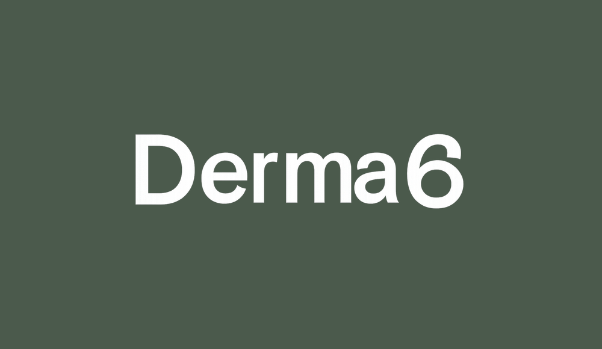

<p align="center">
  
</p>

<p align="center">
  Conversational RAG chatbot for male skincare beginners — diagnose your skin type, build a personalised routine, catch ingredient conflicts, and schedule active introductions.
</p>

<p align="center">
  <a href="https://derma6.streamlit.app/"><strong>Live demo →</strong></a>
</p>

<p align="center">
  
  
  
  
  
</p>

---

## Features

| | Feature | Description |
|---|---|---|
| 💬 | **Skin diagnosis** | Chat-driven questionnaire that builds a skin profile — type, concerns, and experience level |
| 🧴 | **Routine builder** | Generates AM/PM routines sequenced by application order, with conflict awareness built in |
| ⚠️ | **Ingredient conflict checker** | Cross-references products against a compatibility matrix (e.g. Retinol + Salicylic Acid) |
| 📅 | **Active scheduling** | Recommends a gradual introduction plan for strong actives to minimise irritation |
| 📚 | **Focused knowledge base** | 20 documents on skincare actives, sourced from Paula's Choice, INCI Decoder, PubMed, and Reddit r/SkincareAddiction |

---

## Screenshots

<table>
  <tr>
    <td align="center" width="33%">
      
      <br/><sub><b>Assistant Chat</b></sub>
    </td>
    <td align="center" width="33%">
      
      <br/><sub><b>Routine Viewer</b></sub>
    </td>
    <td align="center" width="33%">
      
      <br/><sub><b>My Profile</b></sub>
    </td>
  </tr>
</table>

---

## Tech Stack

| Layer | Technology |
|---|---|
| **Backend** | Python 3.11+, LangChain, ChromaDB, SQLite |
| **Frontend** | Streamlit (3-page app) |
| **LLM** | OpenRouter — `openai/gpt-4o-mini` |
| **Embeddings** | OpenRouter — `qwen/qwen3-embedding-8b` |
| **Package manager** | uv |

## Architecture

```
User prompt
    │
    ▼
Streamlit frontend  ──►  Chat / Routine Viewer / Conflict Checker
    │
    ▼
LangChain RAG chain
    ├── Retriever  ──►  ChromaDB (20 KB documents, no chunking)
    └── LLM        ──►  OpenRouter (gpt-4o-mini)
    │
    ▼
SQLite  ──►  user profile · conversation history · generated routines
```

Documents are embedded whole into ChromaDB — no chunking — since each entry is already a compact, self-contained reference card (≤ 20 entries per project spec).

---

## Setup

### Option A — uv (recommended)

```bash
pip install uv

uv sync --all-extras

cp .env.example .env
# Edit .env — set OPENROUTER_API_KEY=<your key>

uv run python scripts/index_kb.py   # first run only

uv run streamlit run frontend/app.py
```

### Option B — plain pip

```bash
python -m venv .venv
source .venv/bin/activate        # Windows: .venv\Scripts\activate

pip install -r requirements.txt
pip install -e .

cp .env.example .env
# Edit .env — set OPENROUTER_API_KEY=<your key>

python scripts/index_kb.py
streamlit run frontend/app.py
```

> **macOS Intel (x86_64) note:** `requirements.txt` already pins `chromadb<1.0`, `onnxruntime<=1.23.2`, and `pandas<3.0` to avoid broken native extensions on that platform. No extra steps needed.

---

## Running Tests

```bash
# uv
uv run pytest

# plain pip
pip install -r requirements-dev.txt
pytest
```

---

## Knowledge Base

The KB lives in `knowledge_base/` — 20 markdown documents, one per skincare active or rule set. Each document is embedded whole into ChromaDB. Sources are fetched from Paula's Choice, INCI Decoder, PubMed, and Reddit r/SkincareAddiction, then merged by an LLM normalisation pass.

Raw fetched data is stored in `data/raw/` (not committed — regenerate with `uv run scripts/enrich_kb.py`).

See the [Knowledge Base Maintenance](https://github.com/TuringCollegeSubmissions/fgrani-AE.2.5/wiki/Knowledge-Base-Maintenance) wiki page for how to refresh sources, add new ingredients, and run the pipeline in batch.
