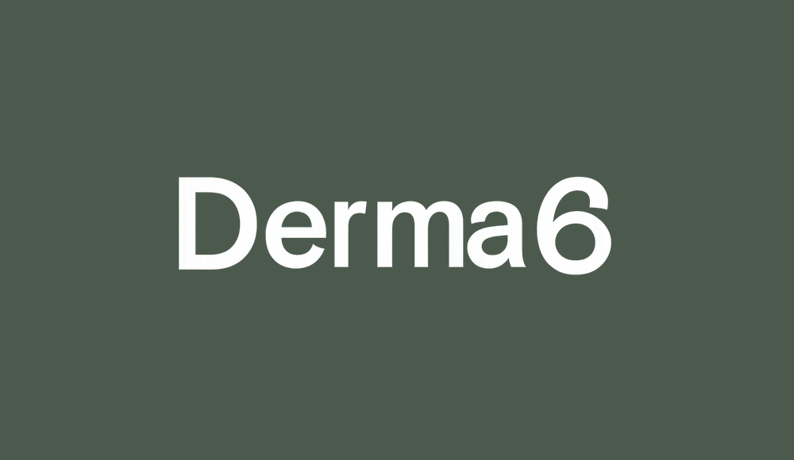

<p align="center">
  
</p>

<p align="center">
  Conversational RAG chatbot for male skincare beginners — diagnose your skin type, build a personalised routine, catch ingredient conflicts, and schedule active introductions.
</p>

<p align="center">
  <a href="https://derma6.streamlit.app/"><strong>Live demo →</strong></a>
</p>

<p align="center">
  
  
  
  
  
</p>

---

## Features

| | Feature | Description |
|---|---|---|
| 💬 | **Skin diagnosis** | Chat-driven questionnaire that builds a skin profile — type, concerns, and experience level |
| 🧴 | **Routine builder** | Generates AM/PM routines sequenced by application order, with conflict awareness built in |
| ⚠️ | **Ingredient conflict checker** | Cross-references products against a compatibility matrix (e.g. Retinol + Salicylic Acid) |
| 📅 | **Active scheduling** | Recommends a gradual introduction plan for strong actives to minimise irritation |
| 📚 | **Focused knowledge base** | 20 documents on skincare actives, sourced from Paula's Choice, INCI Decoder, PubMed, and Reddit r/SkincareAddiction |
| 🔍 | **RAG visualisation** | Inline expander shows retrieved KB chunks, similarity scores, and source snippets per answer |
| 🔧 | **Tool call visualisation** | Expander shows which domain tools fired and their outputs for each assistant turn |
| ⬇️ | **Conversation export** | Download full skincare plan (profile + routines + chat) as HTML or PDF |

---

## Screenshots

<table>
  <tr>
    <td align="center" width="33%">
      
      <br/><sub><b>Assistant Chat</b></sub>
    </td>
    <td align="center" width="33%">
      
      <br/><sub><b>Routine Viewer</b></sub>
    </td>
    <td align="center" width="33%">
      
      <br/><sub><b>My Profile</b></sub>
    </td>
  </tr>
</table>

---

## Tech Stack

| Layer | Technology |
|---|---|
| **Backend** | Python 3.11+, LangChain, ChromaDB, SQLite |
| **Frontend** | Streamlit (3-page app) |
| **LLM** | OpenRouter — `openai/gpt-4o-mini` |
| **Embeddings** | OpenRouter — `qwen/qwen3-embedding-8b` |
| **Package manager** | uv |

## Architecture

```
User prompt
    │
    ▼
Streamlit frontend  ──►  Chat / Routine Viewer / My Profile
    │
    ▼
BackendService  (pure Python, fully decoupled from Streamlit)
    │
    ▼
LangGraph ReAct agent
    ├── Retriever  ──►  ChromaDB (1000-char chunks, 150-char overlap)
    └── 10 Tools   ──►  conflict table · profile store · KB search
    │
    ▼
SQLite  ──►  user profile · conversation history · routines
```

The agent runs as a **LangGraph ReAct loop** — the LLM decides which tool(s) to call, inspects each result, and either invokes more tools or generates a final answer. Responses stream token-by-token via `build_stream()`. `BackendService` is a pure Python layer; Streamlit is a thin presentation shell with no domain logic.

KB documents are split with `RecursiveCharacterTextSplitter` (1000-char chunks, 150-char overlap) before embedding. The conflict table (`knowledge_base/conflict_table.json`) is queried deterministically — never through vector search.

### Security

- Messages capped at 500 characters
- Prompt injection defence: the `SECURITY` instruction is placed last in the system prompt (sandwich pattern), so it is read immediately before the user message — no blocklist, which avoids false positives on common words like "mandate" or "brand"
- Per-user rate limiting (10 requests / 60 s)
- Medical flags trigger a `⚠️ Consult a dermatologist` notice only on specific recommendations; informational answers are unaffected

### Tools

Ten domain tools are registered with the LangGraph agent:

| Tool | Purpose |
| --- | --- |
| `kb_search` | Semantic search over the 20-document knowledge base |
| `conflict_checker` | Deterministic lookup against the ingredient conflict matrix |
| `routine_sequencer` | Orders ingredients by correct application step |
| `save_routine_tool` | Persists a generated routine to the user's profile |
| `skin_type_advisor` | Classifies skin type from KB evidence and conversation |
| `spf_recommender` | Recommends SPF products suitable for the user's profile |
| `introduction_scheduler` | Builds a gradual schedule for introducing strong actives |
| `update_skin_concerns_tool` | Saves identified skin concerns to profile |
| `update_shaving_routine_tool` | Records shaving routine status to profile |
| `add_medical_flag_tool` | Saves diagnosed skin conditions (eczema, rosacea, etc.) |

---

## Evaluation

RAGAs evaluation against a 15-question golden dataset (`eval/eval_dataset.json`). Two evaluation modes are available:

**Agent mode** (default) — runs the full end-to-end system. The agent decides whether to invoke `kb_search`. Measures overall system quality; the LLM may answer from parametric knowledge without retrieval for well-known questions.

**Retriever mode** (`--retriever`) — bypasses the agent entirely. The retriever is called directly for every question and the LLM is constrained to answer from the retrieved chunks only. A clean measure of RAG pipeline quality independent of agent tool-calling behaviour.

| Metric | Agent mode | Retriever mode |
| --- | --- | --- |
| Faithfulness | 0.88 | 0.87 |
| Answer relevancy | 0.81 | 0.84 |
| Context precision | 1.00 | 0.93 |
| Context recall | 0.98 | 0.87 |

```bash
uv run python scripts/eval_rag.py              # agent mode
uv run python scripts/eval_rag.py --retriever  # retriever mode
```

Agent mode scores higher on answer relevancy because the LLM supplements retrieval gaps with training knowledge. Retriever mode exposes the true pipeline quality: context precision at 0.86 and recall at 0.69 show that 2 of 15 questions fell below the minimum score threshold (0.30) and received no retrieved context — a retrieval gap worth addressing with threshold tuning or KB expansion. Faithfulness at 0.88/0.86 across both modes confirms answers stay grounded in the source material — see [ADR-0003](docs/adr/0003-llm-supplements-retrieval-gaps-with-training-data.md).

---

## Design Decisions

Three architectural decisions are documented in [`docs/adr/`](docs/adr/):

| ADR | Decision |
| --- | --- |
| [0001](docs/adr/0001-conflict-checker-uses-json-lookup-not-rag.md) | Conflict checker uses a JSON lookup table, not vector search — conflicts are a finite enumerable set; deterministic lookup avoids synonym mismatches and chunk boundary effects |
| [0002](docs/adr/0002-backend-decoupled-from-frontend.md) | All business logic lives in a pure Python backend, decoupled from Streamlit — the frontend can be swapped without touching domain code |
| [0003](docs/adr/0003-llm-supplements-retrieval-gaps-with-training-data.md) | LLM supplements retrieval gaps with training data — the narrow KB scope makes blending intentional; disclosure is binary (sources shown or not shown), not per-sentence |

---

## Setup

### Option A — uv (recommended)

```bash
pip install uv

uv sync --all-extras

cp .env.example .env
# Edit .env — set OPENROUTER_API_KEY=<your key>

uv run python scripts/index_kb.py   # first run only

uv run streamlit run frontend/app.py
```

### Option B — plain pip

```bash
python -m venv .venv
source .venv/bin/activate        # Windows: .venv\Scripts\activate

pip install -r requirements.txt
pip install -e .

cp .env.example .env
# Edit .env — set OPENROUTER_API_KEY=<your key>

python scripts/index_kb.py
streamlit run frontend/app.py
```

> **macOS Intel (x86_64) note:** `requirements.txt` already pins `chromadb<1.0`, `onnxruntime<=1.23.2`, and `pandas<3.0` to avoid broken native extensions on that platform. No extra steps needed.

---

## Running Tests

```bash
# uv
uv run pytest

# plain pip
pip install -r requirements-dev.txt
pytest
```

The suite covers **90% line coverage** across the `backend/` package:

| Layer | What is tested |
| --- | --- |
| Unit | All 10 tools in isolation |
| Unit | `kb_search` tool — normal retrieval, empty results, exception path, RAG metadata footer |
| Unit | Agent input validation (length cap, injection passthrough to LLM) |
| Unit | System prompt construction (section order, medical flag instruction, SECURITY sandwich) |
| Unit | Citation and RAG context extraction helpers (`_extract_citations`, `_extract_rag_context_from_messages`, etc.) |
| Unit | `ProfileStore` CRUD — skin type, concerns, shaving, medical flags, routines, introduction plans, rename/delete/list |
| Integration | Full chat turn via `BackendService` (tools mocked at the LangGraph boundary) |
| Integration | Medical flag disclaimer delegation to LLM |
| Integration | Onboarding completion trigger (all 4 fields required) |
| RAGAs | End-to-end retrieval quality — `uv run python scripts/eval_rag.py` |

---

## Knowledge Base

The KB lives in `knowledge_base/` — 20 markdown documents, one per skincare active or rule set. Each document is split into chunks and embedded into ChromaDB. Sources are fetched from Paula's Choice, INCI Decoder, PubMed, and Reddit r/SkincareAddiction, then merged by an LLM normalisation pass.

Raw fetched data is stored in `data/raw/` (not committed — regenerate with `uv run scripts/enrich_kb.py`).

See the [Knowledge Base Maintenance](https://github.com/TuringCollegeSubmissions/fgrani-AE.2.5/wiki/Knowledge-Base-Maintenance) wiki page for how to refresh sources, add new ingredients, and run the pipeline in batch.
