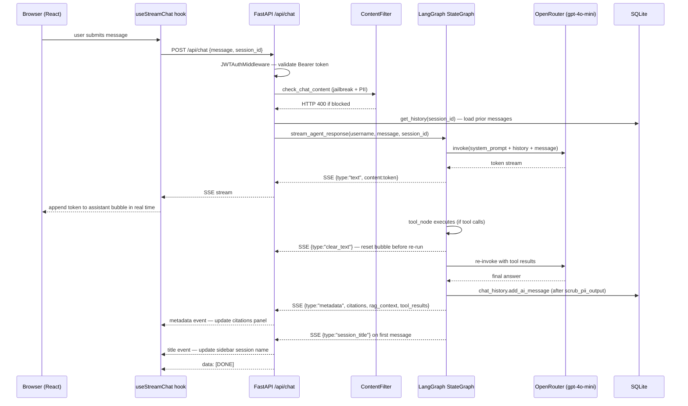
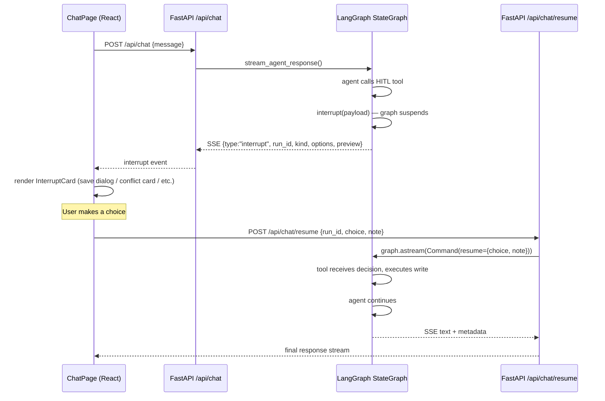
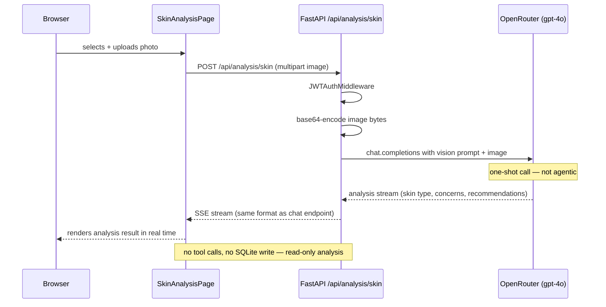

# Architecture

Derma6 v2 is a three-layer system: a React SPA, a FastAPI backend, and a LangGraph agent. Each layer is fully decoupled — the frontend knows nothing about LangGraph, and the agent knows nothing about HTTP.

---

## Data flow diagrams

### Chat message flow



---

### LangGraph agent graph (StateGraph)

```mermaid
flowchart TD
    START([START]) --> agent["agent_node\nllm_with_tools.invoke(system_prompt + messages)"]
    agent -->|no tool calls| END([END])
    agent -->|tool calls present| tools[tool_node / ToolNode]
    tools -->|tool returns normally| agent
    tools -->|tool calls interrupt| PAUSE([graph suspended\nrun_id checkpointed])

    subgraph domain["Domain tools (stateless)"]
        D1[kb_search\nagentic RAG pipeline]
        D2[conflict_checker\nJSON lookup]
        D3[routine_sequencer\napplication order sort]
        D4[skin_type_advisor_tool]
        D5[introduction_scheduler_tool]
        D6[spf_recommender]
    end

    subgraph hitl["HITL tools (call interrupt before writing)"]
        H1[save_routine_tool\nroutine_diff card]
        H2[update_beard_style_tool\nbeard_style_select card]
        H3[update_location_tool\nlocation_input card]
        H4[add_medical_flag_tool\nmedical_flag_confirm card]
        H5[finalize_onboarding_tool\nonboarding_review card]
        H6[propose_conflict_resolution_tool\nconflict_resolution card]
    end

    tools --- domain
    tools --- hitl
```



---

### HITL interrupt / resume flow



---

### Agentic RAG pipeline (inside `kb_search`)


---

### Vision / skin analysis flow



---

## Request lifecycle (chat turn)

```text
1.  User types a message in ChatPage.tsx
2.  useStreamChat POSTs to /api/chat with { message, session_id }
3.  JWTAuthMiddleware validates the Bearer token; username → request.state
4.  ContentFilter (Depends): jailbreak regex + PII patterns; HTTP 400 if matched
5.  chat.py calls stream_agent_response(username, session_id, message)
6.  SQLite: get_history(session_id) loads prior messages
7.  LangGraph StateGraph: agent_node → (tool_node →)* agent_node → END
8.  Each LLM token → SSE {type:"text", content:"..."}
9.  After tool → re-run → SSE {type:"clear_text"} resets the bubble
10. HITL tool → interrupt() suspends graph → SSE {type:"interrupt", run_id, ...}
11. Resume: POST /api/chat/resume → Command(resume) → graph continues
12. End of turn → SSE {type:"metadata", citations, rag_context, tool_results}
13. First message → SSE {type:"session_title"} — sidebar updates
14. SQLite: chat_history.add_ai_message(scrub_pii_output(answer))
15. data: [DONE]
```

### SSE event types

| `type` field | When emitted | Shape |
| --- | --- | --- |
| `text` | Every LLM output token | `{"type":"text","content":"word"}` |
| `clear_text` | Agent re-runs after a tool call | `{"type":"clear_text"}` |
| `interrupt` | HITL tool calls `interrupt()` | `{"type":"interrupt","run_id":"...","kind":"...","title":"...","options":[...]}` |
| `metadata` | End of successful turn | `{"type":"metadata","citations":[...],"rag_context":[...],"tool_results":[...],"rag_routing":"...","rag_fallback_triggered":false}` |
| `session_title` | First message in a new session | `{"type":"session_title","session_id":"...","title":"..."}` |
| `error` | On exception or rate-limit | `{"type":"error","content":"message"}` |
| _(terminal)_ | Always last | `data: [DONE]` |

---

## Content filter

`backend/middleware/content_filter.py` attaches to `/api/chat` as a FastAPI `Depends`. It has three responsibilities:

**Input jailbreak detection** — a compiled regex matches patterns like:
- `ignore previous instructions`, `forget your training`, `DAN mode`, `jailbreak`
- `you are now`, `act as if you are`, persona/role-switch phrases
- `<system>` tag injection, `system: ...` prefix injection
- `disable safety filters`, `bypass restrictions`

Returns HTTP 400 with a generic error message; does not reveal which pattern matched.

**Input PII detection** — four pattern groups (most-to-least-specific):
1. Credit card numbers (Visa, Mastercard, Amex, Diners, Discover)
2. US Social Security Numbers
3. Email addresses
4. Phone numbers (US format, with/without country code)

Returns HTTP 400 with a user-friendly message naming the PII type detected.

**Output PII scrubbing** — after the agent streams its full response, `scrub_pii_output()` replaces email, phone, and SSN patterns with `[email]`, `[phone]`, `[ssn]` before the text is stored in `chat_messages`. The streamed text has already reached the client; scrubbing is storage-only.

---

## LangGraph graph structure

```text
START
  │
  ▼
agent_node  ──(no tool calls)──►  END
  │
  │ (tool calls present)
  ▼
tool_node
  │ returns normally
  ▼
agent_node  ──── (loop until no tool calls) ────►  END
  │
  │ (HITL tool calls interrupt())
  ▼
graph suspended — awaiting /api/chat/resume
  │ Command(resume={choice, note})
  ▼
tool_node resumes → agent_node → END
```

The graph uses `tools_condition` from `langgraph.prebuilt` to decide whether to route to `tool_node` or `END`. The checkpointer is `MemorySaver` (module-level singleton), keyed by `run_id` (`{session_id}-{uuid}`). See [ADR-0001](../adr/0001-explicit-stategraph-over-create-react-agent.md).

### State

The graph state is `MessagesState` — a list of `BaseMessage` objects. Each turn:

1. `get_history()` loads prior messages from SQLite and prepends them.
2. The new `HumanMessage` is appended.
3. The graph runs; all messages (including tool calls/results) are produced.
4. After streaming, the assistant's final answer is scrubbed and persisted to SQLite.

### Tool closure pattern

Tools are defined inside `_make_tools(username, store)` and capture per-user dependencies via closure at agent construction time:

```python
def _make_tools(username: str, store: ProfileStore) -> list:
    @lc_tool
    def save_routine_tool(name: str, steps: str) -> str:
        # username and store are captured from _make_tools scope
        ...
```

This avoids a global registry and makes per-user data isolation trivial. The audit logger is called at the top of every tool before any external call.

---

## Database schema

All tables live in a single SQLite file (default `./data/skincare.db`).

### `users`
| Column | Type | Notes |
| --- | --- | --- |
| `id` | INTEGER PK | |
| `username` | TEXT UNIQUE | |
| `hashed_password` | TEXT | bcrypt |
| `role` | TEXT | `"user"` or `"admin"` |
| `created_at` | DATETIME | |

### `sessions`
| Column | Type | Notes |
| --- | --- | --- |
| `id` | INTEGER PK | |
| `username` | TEXT | FK → users |
| `session_id` | TEXT UNIQUE | UUID |
| `title` | TEXT | auto-generated from first message via LLM |
| `total_prompt_tokens` | INTEGER | accumulated per session |
| `total_completion_tokens` | INTEGER | accumulated per session |
| `total_cost_usd` | REAL | accumulated per session |
| `created_at` | DATETIME | |
| `updated_at` | DATETIME | |

### `chat_messages`
| Column | Type | Notes |
| --- | --- | --- |
| `id` | INTEGER PK | |
| `session_id` | TEXT | FK → sessions |
| `role` | TEXT | `"user"` / `"assistant"` |
| `content` | TEXT | PII-scrubbed before insert |
| `created_at` | DATETIME | |

### `skin_profiles`
Stores one row per user. Serialises lists/dicts as JSON columns (routines, concerns, medical flags, introduction plans).

---

## Auth flow

```text
POST /auth/register  →  hash password, insert user, return JWT
POST /auth/login     →  verify password, return JWT
```

Every subsequent request must include `Authorization: Bearer <token>`.

`JWTAuthMiddleware` (a `BaseHTTPMiddleware`) runs before every route except `/auth/*`, `/health`, and `/docs`. On success it writes `request.state.username`. Route handlers use `Depends(get_current_user)` to read it.

The frontend stores the token in `localStorage`. On any 401 response the `api.ts` axios interceptor clears the token and redirects to `/login`.

---

## Vector store

ChromaDB persists embeddings to `./data/chroma` (configurable via `CHROMA_PERSIST_DIR`).

- **Documents:** 20 markdown files in `knowledge_base/`
- **Splitter:** `RecursiveCharacterTextSplitter` — 1000-char chunks, 150-char overlap
- **Embeddings:** OpenRouter `qwen/qwen3-embedding-8b` (served via the same API key)
- **Retrieval:** handled by the Agentic RAG pipeline (see diagram above); baseline top-4 by cosine similarity, filtered at `RETRIEVAL_MIN_SCORE=0.3`

The conflict table (`knowledge_base/conflict_table.json`) is loaded deterministically at startup and never goes through vector search. See [ADR-0003](../adr/0003-conflict-checker-uses-json-lookup-not-rag.md).

---

## Skin analysis (vision)

`POST /api/analysis/skin` accepts a multipart upload (image file). The image is base64-encoded and sent to `openai/gpt-4o` via OpenRouter with a structured prompt asking for skin type, visible concerns, and product recommendations. The response is streamed as SSE in the same format as the chat endpoint.

The vision call is intentionally separate from the LangGraph graph — it is a one-shot analysis, not an agentic loop. No tools are called, no SQLite write occurs.

---

## Token accounting

Every `stream_agent_response()` call accumulates `input_tokens` and `output_tokens` from `usage_metadata` on the final streaming chunk. Cost is taken from the OpenRouter `token_usage.cost` field when present; otherwise calculated from the pricing table in `backend/pricing.py`. Totals are written to the `sessions` table via `add_token_usage()`.

The Admin page surfaces per-user and per-session totals in the Users & Cost tab.

---

## Logging

Structured JSON logging via a custom `JsonFormatter`. Three log destinations:

| Logger | Sink | Content |
| --- | --- | --- |
| `uvicorn.access` | stdout | HTTP access log |
| `derma6.*` | `./logs/app.log` | Application + agent logs |
| `derma6.audit` | `./logs/audit.log` | Tool invocations (username, tool name, input summary) |

LangSmith tracing is activated automatically when `LANGSMITH_API_KEY` is non-empty. Every agent run becomes a traced run under the `derma6` project.

---

## Frontend structure

```text
frontend/src/
├── pages/
│   ├── LoginPage.tsx         login / register form
│   ├── ChatPage.tsx          main chat interface + HITL interrupt cards
│   ├── ProfilePage.tsx       skin profile viewer
│   ├── RoutinesPage.tsx      saved AM/PM routines
│   ├── SkinAnalysisPage.tsx  photo upload + vision analysis
│   └── AdminPage.tsx         admin user management + eval dashboard
├── components/
│   ├── layout/Sidebar.tsx    nav + session list (logo links to new chat)
│   └── ui/                   shadcn/ui primitives
├── hooks/
│   ├── useStreamChat.ts      SSE streaming + interrupt state
│   └── useSessions.ts        session CRUD via TanStack Query
└── lib/
    ├── api.ts                axios instance + auth interceptor
    ├── auth.tsx              AuthContext (token + username)
    └── sessionContext.tsx    active session state
```

TanStack Router is configured in `main.tsx`. All routes under the `protectedRoute` parent require a valid JWT token; unauthenticated requests are redirected to `/login`.
