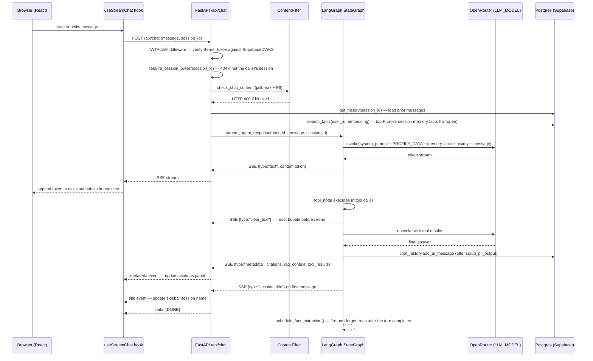
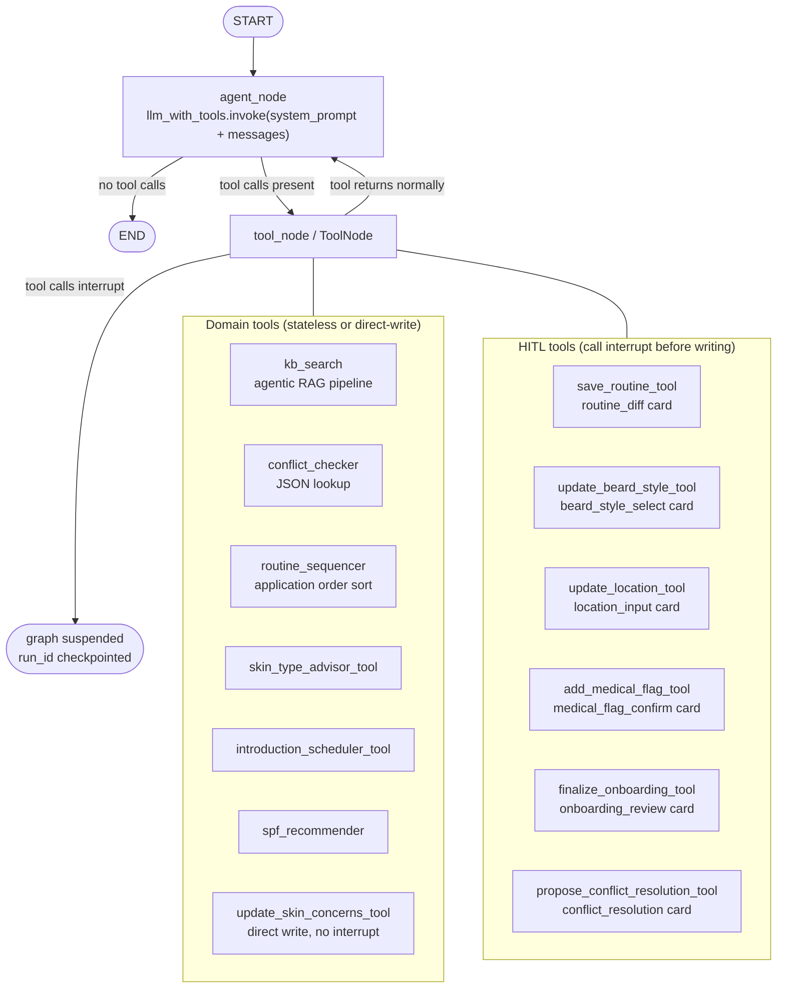
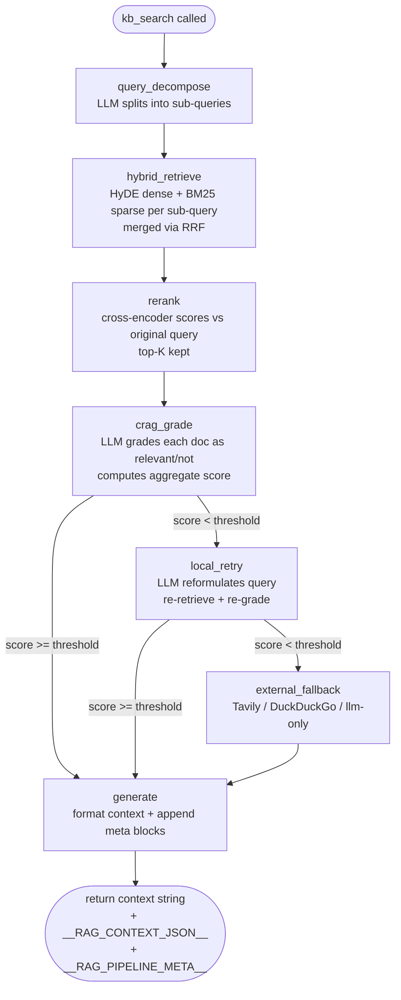

# Architecture

**TL;DR** — Derma6 is a three-layer system: a React SPA, a FastAPI backend, and a LangGraph agent, each fully decoupled (the frontend knows nothing about LangGraph; the agent knows nothing about HTTP). Auth is Supabase (JWKS-verified), storage is Postgres via Supabase with an `AsyncPostgresSaver` checkpointer so HITL interrupts survive restarts, and the KB lives in ChromaDB. This page covers request/data flow, the LangGraph graph shape, the database schema, and the auth flow in detail — for the agentic RAG pipeline internals or the cross-session memory system, see their dedicated pages.

---

## Data flow diagrams

### Chat message flow



---

### LangGraph agent graph (StateGraph)



---

### HITL interrupt / resume flow

```mermaid
sequenceDiagram
    participant C as ChatPage (React)
    participant F as FastAPI /api/chat
    participant G as LangGraph StateGraph
    participant R as FastAPI /api/chat/resume

    C->>F: POST /api/chat {message}
    F->>G: stream_agent_response()
    G->>G: agent calls HITL tool
    G->>G: interrupt(payload) — graph suspends; run_id checkpointed to Postgres
    G-->>F: SSE {type:"interrupt", run_id, kind, options, preview}
    F-->>C: interrupt event
    C->>C: render InterruptCard (save dialog / conflict card / etc.)
    Note over C: User makes a choice — the graph survives a server\nrestart here since state lives in AsyncPostgresSaver, not memory
    C->>R: POST /api/chat/resume {run_id, choice, note}
    R->>R: get_run_owner(run_id) + get_session_owner(session_id) — both must match the caller
    R->>G: graph.astream(Command(resume={choice, note}))
    G->>G: tool receives decision, executes write
    G->>G: agent continues
    G-->>R: SSE text + metadata
    R-->>C: final response stream
```

---

### Agentic RAG pipeline (inside `kb_search`)



---

### Vision / skin analysis flow

```mermaid
sequenceDiagram
    participant U as Browser
    participant S as SkinAnalysisPage
    participant F as FastAPI /api/me/analyze-skin
    participant V as OpenRouter (VISION_MODEL)
    participant DB as Postgres

    U->>S: selects + uploads photo
    S->>F: POST /api/me/analyze-skin (multipart image)
    F->>F: JWTAuthMiddleware + per-user rate limit + pre-read size rejection
    F->>F: base64-encode image bytes
    F->>V: structured_completion(schema=SkinAnalysisResult, vision prompt + image)
    Note over V: one-shot call — not agentic;\nresponse_format JSON schema, falls back to prompt-based parsing
    V-->>F: parsed SkinAnalysisResult (condition, confidence, alternatives, disclaimer)
    F->>DB: persist SkinAnalysis row (full image + thumbnail)
    F-->>S: SSE stream (same format as chat endpoint)
    S-->>U: renders analysis result in real time
    Note over S,F: no LangGraph tool calls — a separate, non-agentic vision call
```

---

## Request lifecycle (chat turn)

```text
1.  User types a message in ChatPage.tsx
2.  useStreamChat POSTs to /api/chat with { message, session_id }
3.  JWTAuthMiddleware verifies the Bearer token against Supabase's JWKS; user_id (sub claim) → request.state
4.  require_session_owner(session_id) — 404 if the session isn't the caller's
5.  ContentFilter (Depends): jailbreak regex + PII patterns; HTTP 400 if matched
6.  chat.py calls stream_agent_response(user_id, session_id, message)
7.  Postgres: get_history(session_id) loads prior messages; search_facts() loads top-K memory facts (fail-open)
8.  LangGraph StateGraph: agent_node → (tool_node →)* agent_node → END
9.  Each LLM token → SSE {type:"text", content:"..."}
10. After tool → re-run → SSE {type:"clear_text"} resets the bubble
11. HITL tool → interrupt() suspends graph (checkpointed to Postgres) → SSE {type:"interrupt", run_id, ...}
12. Resume: POST /api/chat/resume → ownership re-checked → Command(resume) → graph continues
13. End of turn → SSE {type:"metadata", citations, rag_context, tool_results}
14. First message → SSE {type:"session_title"} — sidebar updates
15. Postgres: chat_history.add_ai_message(scrub_pii_output(answer))
16. data: [DONE]
17. Fire-and-forget background task extracts + stores new memory facts from the turn
```

### SSE event types

| `type` field | When emitted | Shape |
| --- | --- | --- |
| `text` | Every LLM output token | `{"type":"text","content":"word"}` |
| `clear_text` | Agent re-runs after a tool call | `{"type":"clear_text"}` |
| `interrupt` | HITL tool calls `interrupt()` | `{"type":"interrupt","run_id":"...","kind":"...","title":"...","options":[...]}` |
| `metadata` | End of successful turn | `{"type":"metadata","citations":[...],"rag_context":[...],"tool_results":[...],"rag_routing":"...","rag_fallback_triggered":false}` |
| `session_title` | First message in a new session | `{"type":"session_title","session_id":"...","title":"..."}` |
| `error` | On exception or rate-limit | `{"type":"error","content":"message"}` |
| _(terminal)_ | Always last | `data: [DONE]` |

---

## Content filter

**TL;DR** — every chat/resume request passes through jailbreak and PII regex checks before it reaches the agent, and the assistant's stored (not streamed) reply is PII-scrubbed on the way into the database. The jailbreak pattern is factored into its own module, `backend/security_patterns.py`, so both this filter and the profile-field validators in `backend/schemas.py` share one source of truth without an import cycle.

`backend/middleware/content_filter.py` attaches to `/api/chat` and `/api/chat/resume` as a FastAPI `Depends`. It has three responsibilities:

**Input jailbreak detection** — a compiled regex matches patterns like:
- `ignore previous instructions`, `forget your training`, `DAN mode`, `jailbreak`
- `you are now`, `act as if you are`, persona/role-switch phrases
- `<system>` tag injection, `system: ...` prefix injection
- `disable safety filters`, `bypass restrictions`

Returns HTTP 400 with a generic error message; does not reveal which pattern matched.

**Input PII detection** — four pattern groups (most-to-least-specific):
1. Credit card numbers (Visa, Mastercard, Amex, Diners, Discover)
2. US Social Security Numbers
3. Email addresses
4. Phone numbers (US format, with/without country code)

Returns HTTP 400 with a user-friendly message naming the PII type detected.

**Output PII scrubbing** — after the agent streams its full response, `scrub_pii_output()` replaces email, phone, and SSN patterns with `[email]`, `[phone]`, `[ssn]` before the text is stored via `chat_history.add_ai_message()`. The streamed text has already reached the client; scrubbing is storage-only.

---

## LangGraph graph structure

**TL;DR** — the graph itself is a small loop (`agent_node` ⇄ `tool_node` until no tool calls, or `END`); what changed since v2 is the checkpointer. It's now `AsyncPostgresSaver`, not an in-process `MemorySaver`, so an interrupted HITL run survives a backend restart or lands on a different instance and can still be resumed.

```text
START
  │
  ▼
agent_node  ──(no tool calls)──►  END
  │
  │ (tool calls present)
  ▼
tool_node
  │ returns normally
  ▼
agent_node  ──── (loop until no tool calls) ────►  END
  │
  │ (HITL tool calls interrupt())
  ▼
graph suspended — awaiting /api/chat/resume
  │ Command(resume={choice, note})
  ▼
tool_node resumes → agent_node → END
```

The graph uses `tools_condition` from `langgraph.prebuilt` to decide whether to route to `tool_node` or `END`. The checkpointer is `AsyncPostgresSaver` (opened once in the FastAPI lifespan via `init_checkpointer()`, backed by the same Supabase `DATABASE_URL`), keyed by `run_id` (`{session_id}-{uuid}`). `get_run_owner()` reads the `user_id` stamped into the checkpoint's config metadata to authorize a resume without trusting the client. See [ADR-0001](../adr/0001-explicit-stategraph-over-create-react-agent.md).

### State

The graph state is `MessagesState` — a list of `BaseMessage` objects. Each turn:

1. `get_history()` loads prior messages from Postgres and prepends them, alongside up to `MEMORY_RETRIEVAL_TOP_K` cross-session memory facts folded into the system prompt (see [Cross-Session Memory](Memory.md)).
2. The new `HumanMessage` is appended.
3. The graph runs; all messages (including tool calls/results) are produced.
4. After streaming, the assistant's final answer is scrubbed and persisted to Postgres, and fact extraction is scheduled in the background.

### Tool closure pattern

Tools are defined inside `_make_tools(user_id, store)` and capture per-user dependencies via closure at agent construction time:

```python
def _make_tools(user_id: str, store: ProfileStore) -> list:
    @lc_tool
    def save_routine_tool(name: str, steps: list[RoutineStepInput]) -> str:
        # user_id and store are captured from _make_tools scope
        ...
```

This avoids a global registry and makes per-user data isolation trivial. The audit logger (`_audit(user_id, tool_name, args_summary)`) is called at the top of every tool before any external call, writing to `derma6.audit`.

---

## Database schema

**TL;DR** — Postgres via Supabase, schema-managed by Alembic (current head: `6b570fa827b2`). `users.id` is the Supabase-issued UUID, not a local autoincrement — every other table FKs off it. Chat history itself lives in LangChain's own `message_store` table plus the LangGraph checkpointer's tables, not a hand-rolled `chat_messages` table.

### `users`
| Column | Type | Notes |
| --- | --- | --- |
| `id` | TEXT PK | Supabase-issued UUID, always supplied at insert — never generated locally |
| `username` | TEXT | Display name only — **not unique**, not an identifier (see [Security](Security.md)) |
| `email` | TEXT UNIQUE | The actual identifier, indexed |
| `skin_type` | TEXT, nullable | Enum-constrained at the schema layer (`ProfilePatch.skin_type`) |
| `skin_concerns`, `medical_flags` | TEXT, nullable | JSON-serialised `list[str]` |
| `has_shaving_routine`, `beard_style`, `location` | nullable | Profile fields |
| `onboarding_complete`, `is_admin` | BOOLEAN | |
| `created_at`, `updated_at` | TIMESTAMP | |

### `routines` / `routine_steps`
`routines` has `UniqueConstraint(user_id, name)` — a DB-level backstop for the case-insensitive collision check in `ProfileStore`. Each routine has ordered `routine_steps` (`position`, `ingredient`, `product_name`, `budget_product`).

### `chat_sessions`
| Column | Type | Notes |
| --- | --- | --- |
| `id` | TEXT PK | UUID |
| `user_id` | TEXT | FK → users |
| `title` | TEXT, nullable | auto-generated from the first message via LLM |
| `total_prompt_tokens`, `total_completion_tokens` | INTEGER | accumulated per session |
| `total_cost_usd` | FLOAT | accumulated per session |
| `created_at`, `updated_at` | TIMESTAMP | |

Actual message content lives in LangChain's `message_store` table (raw SQL, `backend/db/session_store.py`), keyed by session id — not a `chat_messages` table.

### `introduction_plans`, `skin_analyses`
`introduction_plans` stores a JSON-serialised phased schedule + status. `skin_analyses` stores one row per vision-analysis run — condition, confidence, JSON-serialised alternatives, and both a full-size and thumbnail base64 image.

### `user_memory_facts` (cross-session memory, `pgvector`)
| Column | Type | Notes |
| --- | --- | --- |
| `id` | INTEGER PK | |
| `user_id` | TEXT | FK → users, `ON DELETE CASCADE` |
| `fact_text` | TEXT | |
| `embedding` | `vector(4096)` | Width matches `qwen/qwen3-embedding-8b`, confirmed empirically — not assumed |
| `source_session_id` | TEXT, nullable | FK → chat_sessions, `ON DELETE SET NULL` — a fact outlives the session it came from |
| `created_at` | TIMESTAMP | |

No ANN index — pgvector's HNSW/ivfflat cap out at 2000 dimensions, below this table's 4096. See [Cross-Session Memory](Memory.md) for why an unindexed per-user scan is fine at current scale.

Plus the LangGraph checkpointer's own tables (created by `AsyncPostgresSaver.setup()`), which hold suspended HITL run state.

---

## Auth flow

**TL;DR** — Supabase owns identity end-to-end (email/password, session issuance, refresh). The backend never issues its own tokens; it only verifies Supabase's JWTs (JWKS/ES256, with an HS256 fallback path) and lazily provisions a local `users` row from the verified claims on first authenticated request.

```text
Supabase supabase.auth.signUp() / signInWithPassword()  →  Supabase issues + refreshes the session
POST /api/auth/complete-signup (authenticated)           →  provisions the local users row, idempotent
```

Every subsequent request must include `Authorization: Bearer <supabase-jwt>`.

`JWTAuthMiddleware` (a `BaseHTTPMiddleware`) runs before every route except `/health`, `/docs`, `/openapi.json`, and `/redoc`. It calls `verify_supabase_jwt()`, which dispatches on the JWT header's `alg` — the live deployment uses JWKS/ES256 exclusively (confirmed empirically; the HS256 shared-secret path exists but is inactive). On success it writes `request.state.user_id` (the `sub` claim) and `request.state.user_claims`. `get_current_user()` additionally requires a local `users` row to exist — an unprovisioned-but-valid identity gets a 412, not a silent row, until `/complete-signup` runs.

The JWKS cache is replaced wholesale (never merged) on refresh, throttled to one refresh per 30 s, with a 300 s max age forcing periodic re-validation even on cache hits — see [Security](Security.md) for the rationale.

The frontend never touches a raw token directly — `supabase-js` persists and auto-refreshes the session. On logout or any Supabase auth-state change, the frontend clears its React Query cache and session-scoped UI state before/alongside `supabase.auth.signOut()`.

---

## Vector store

ChromaDB persists KB embeddings to `./data/chroma` (configurable via `CHROMA_PERSIST_DIR`). Cross-session memory facts use a separate store — `pgvector` inside the same Postgres database, not ChromaDB — since they're per-user relational data with a foreign key to `chat_sessions`, not a shared corpus.

- **Documents:** 20 markdown files in `knowledge_base/`
- **Splitter:** `RecursiveCharacterTextSplitter` — 1000-char chunks, 150-char overlap
- **Embeddings:** OpenRouter `qwen/qwen3-embedding-8b` (served via the same API key)
- **Retrieval:** handled by the Agentic RAG pipeline (see diagram above); baseline top-4 by cosine similarity, filtered at `RETRIEVAL_MIN_SCORE=0.3`

The conflict table (`knowledge_base/conflict_table.json`) is loaded deterministically at startup and never goes through vector search. See [ADR-0003](../adr/0003-conflict-checker-uses-json-lookup-not-rag.md).

---

## Skin analysis (vision)

`POST /api/me/analyze-skin` accepts a multipart upload (image file), behind auth plus a dedicated per-user rate limiter and pre-read size rejection. The image is base64-encoded and sent via `structured_completion()` (OpenAI strict-mode JSON schema, prompt-based fallback) to `VISION_MODEL` via OpenRouter, asking for a `SkinAnalysisResult` — condition, confidence, differential alternatives, disclaimer. The parsed result is persisted as a `skin_analyses` row (full image + thumbnail) and streamed as SSE in the same format as the chat endpoint.

The vision call is intentionally separate from the LangGraph graph — it is a one-shot analysis, not an agentic loop. No LangGraph tools are called.

---

## Token accounting

Every `stream_agent_response()` call accumulates `input_tokens` and `output_tokens` from `usage_metadata` on the final streaming chunk. Cost is taken from the OpenRouter `token_usage.cost` field when present; otherwise calculated from the pricing table in `backend/pricing.py`. Totals are written to `chat_sessions` via `add_token_usage()`.

The Admin page surfaces per-user and per-session totals in the Users & Cost tab.

---

## Logging

Structured JSON logging via a custom `JsonFormatter`. Three log destinations:

| Logger | Sink | Content |
| --- | --- | --- |
| `uvicorn.access` | stdout | HTTP access log |
| `derma6.*` | `./logs/app.log` | Application + agent logs |
| `derma6.audit` | `./logs/audit.log` | Tool invocations (`user_id`, tool name, sanitised args summary) |

LangSmith tracing is activated automatically when `LANGSMITH_API_KEY` is non-empty. Every agent run becomes a traced run under the `derma6` project.

---

## Frontend structure

```text
frontend/src/
├── pages/
│   ├── SignInPage.tsx / SignUpPage.tsx / VerifyEmailCallback.tsx  Supabase auth flow
│   ├── ChatPage.tsx          main chat interface + HITL interrupt cards
│   ├── ProfilePage.tsx       skin profile viewer
│   ├── RoutinesPage.tsx      saved AM/PM routines
│   ├── SkinAnalysisPage.tsx  photo upload + vision analysis
│   └── AdminPage.tsx         admin user management + eval dashboard
├── components/
│   ├── layout/Sidebar.tsx    nav + session list (logo links to new chat)
│   └── ui/                   shadcn/ui primitives
├── hooks/
│   ├── useStreamChat.ts      SSE streaming + interrupt state
│   └── useSessions.ts        session CRUD via TanStack Query
└── lib/
    ├── api.ts                axios instance + auth interceptor
    ├── auth.tsx               Supabase session context, React Query cache lifecycle
    └── sessionContext.tsx    active session state
```

TanStack Router is configured in `main.tsx`. All routes under the `protectedRoute` parent require a valid Supabase session; unauthenticated requests are redirected to sign-in.
