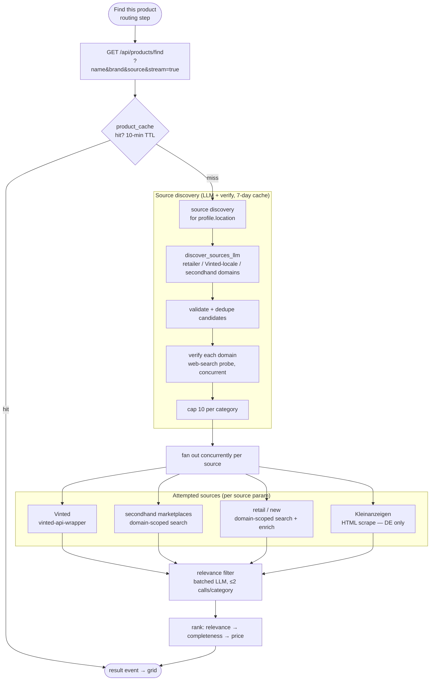

# Product Finder

**TL;DR** — a manually-triggered lookup that surfaces real, buyable listings (retail *new* + secondhand *used*) next to a product Derma6 recommends. The user clicks **Find this product** on a routine step, an anchored popover opens with a staged search animation, then fills with a mixed grid of listings — price (when found), source, thumbnail, and a link out. It is **not** an agent tool: it's a standalone, auth-gated HTTP route (`GET /api/products/find`) the frontend calls directly, so the LangGraph agent, chat contract, and RAG pipeline are entirely untouched. Where to buy depends on *where you are*, so an LLM-driven **source-discovery** step first figures out the right retailers/marketplaces for the user's location, then the lookup fans out across them concurrently.

---

## Why a separate route, not an agent tool

Finding a product to buy is a lookup, not a reasoning task — there's no conversation to have about it, and threading it through the ReAct loop would only add latency and token cost. It also has a fundamentally different shape from the domain tools: it streams *progress* (which retailer is being checked right now), not tokens, and it fires several times in parallel from one UI gesture. So it lives in `backend/tools/product_finder.py` as its own FastAPI `APIRouter` (`prefix="/api/products"`), mounted alongside the agent rather than inside it.

---

## The pipeline



Every source **never raises** — a timeout or upstream failure degrades to `([], False)` for that source so the others still return. The response carries two booleans, `retail_ok` / `secondhand_ok`, that are `False` only on *failure*, never on a legitimate zero-result search — that's how the UI tells "nothing found" apart from "that source is down."

---

## Source discovery (`product_source_discovery.py`)

Retailers and marketplaces are location-specific, and hardcoding a per-country table doesn't scale. Instead, on the first lookup for a given normalized location:

1. **Discover** — one `structured_completion()` call (`SOURCE_DISCOVERY_MODEL`, falling back to the chat model) asks for candidate `retailer_domains`, a `vinted_locale_domain`, and `secondhand_marketplace_domains`, over-fetching up to 15 per list ordered by prominence. If the model can't confidently place the location (`location_recognized = false`), that's treated as a discovery failure — never as "guess another location."
2. **Validate + dedupe** — each candidate is syntactically validated (a bare registrable domain, not a URL/path) and de-duplicated. The Vinted candidate must additionally be a known Vinted locale domain (e.g. `vinted.it`).
3. **Verify** — each surviving candidate gets a live web-search probe (concurrent, retailer and secondhand batches in parallel) to confirm it actually returns results before it's trusted.
4. **Cap** — the first 10 verified survivors per category are kept (`_MAX_DOMAINS_PER_CATEGORY`).

The verified `DiscoveredSources` is cached in its own SQLite store (`source_discovery.db`, **7-day** TTL) keyed by normalized location. **Germany** has a hardcoded seed fallback (`_germany_seed_sources()`) used when discovery is unavailable — it is deliberately never cached. A request whose lookups don't depend on discovered domains (`source=kleinanzeigen`) skips discovery entirely.

---

## Sources

| Source | Type | Mechanism | Notes |
|---|---|---|---|
| **Vinted** | used | `vinted-api-wrapper` (Cloudflare-bypass + JSON) | Locale from the discovered `vinted.<cc>` domain; run in a thread, timeout-bounded |
| **Retail** | new | Domain-scoped web search (Tavily → DuckDuckGo) per discovered retailer domain | Price + thumbnail enrichment (below) |
| **Secondhand marketplaces** | used | Same domain-scoped search, over discovered non-Vinted marketplaces | Search-and-tag only — no enrichment pass |
| **Kleinanzeigen** | used | Bespoke HTML scrape of the search results page | **Germany-only**, gated on `profile.location`; no structured API exists, so `article.aditem` markup can drift |

**Domain-scoped search** (`domain_search.py`) is the shared primitive: one query scoped to exactly one domain via Tavily's `include_domains=[domain]` (preferred) or a DuckDuckGo `site:domain` qualifier (fallback). Each domain in a category is queried as its own concurrent coroutine; results are interleaved round-robin by source so no single retailer (in practice, Amazon) dominates the grid.

### Enrichment (retail only)

A web search rarely returns a clean structured price or image per result, so retail listings get two best-effort, independently-timed-out enrichment passes — each guarded so a slow/broken page costs that listing its thumbnail or price, never the whole lookup:

- **Thumbnail** — fetch the listing page and read `og:image` → `twitter:image` → schema.org `Product` JSON-LD `image` → Amazon's `data-a-dynamic-image`. Fetched with a link-preview-crawler User-Agent, since several retailers serve the real page (og:image included) to crawlers but a bot-challenge page to a desktop UA.
- **Price** — for listings whose snippet yielded no price, re-fetch and read `product:price:amount` meta → `itemprop="price"` microdata → JSON-LD `offers.price` → Amazon's `.a-price .a-offscreen`. Amounts are normalized across German (`12,99`) and English (`12.99`) conventions.

---

## Relevance filter (`relevance_filter.py`)

Domain-scoped search returns plausible-but-off-target results (accessories, unrelated products from the same retailer). `filter_category` runs a **batched** relevance-classification LLM call over a category's candidates — the model is handed a numbered list and returns only the indices it judges genuine. If filtering drops too many, a **bounded backfill** pulls replacements from the pre-diversification raw pool and reclassifies them. This is capped at **two `_classify_relevance` calls per category, by construction** (no loop) — enrichment runs *after* filtering, so no fetch is ever spent on a candidate that would be discarded.

---

## Streaming & the loading state

`GET /api/products/find` supports two response modes:

- `stream=false` (default) — a plain `ProductFindResponse` JSON body. Unchanged, simple contract.
- `stream=true` — a `text/event-stream` emitting **stage events** as the work happens, then one terminal `result` event, then `[DONE]`.

The frontend fires **one streaming request per source** (`source=retail|vinted|kleinanzeigen`) in parallel so each card populates as its own source finishes, rather than the whole popover waiting on the slowest one. Stage events drive the rotating phrase in the search animation:

| `stage` | Emitted when |
|---|---|
| `discovery` | Source discovery runs (cache miss only) — "Assessing retailers for …" |
| `domain_check` | A specific domain's query dispatches — "Checking dm.de…" |
| `relevance_filter` | The relevance-classification pass runs |
| `thumbnail_enrichment` | Retail thumbnails are being fetched |
| `price_enrichment` | Retail prices are being re-fetched from listing pages |

Stage emission is a synchronous, non-blocking `asyncio.Queue.put_nowait` (`QueuedStageEmitter`), so it never serializes the concurrent source lookups. A cache hit emits **zero** stage events. On the client, `useProductFind` exposes the most recent `stagePhrase` (cleared to `null` on the terminal event), and `dedupeStagePhrases` collapses the pending sources' phrases into a distinct rotating set.

---

## Response shape

```json
{
  "listings": [
    {
      "type": "new",
      "title": "Balea Vitamin C Serum, 30 ml",
      "price": 3.95,
      "currency": "EUR",
      "source": "dm.de",
      "thumbnail_url": "https://…/image.jpg",
      "listing_url": "https://www.dm.de/…"
    },
    { "type": "used", "title": "…", "price": null, "currency": null, "source": "Vinted", "thumbnail_url": "…", "listing_url": "…" }
  ],
  "retail_ok": true,
  "secondhand_ok": true
}
```

`price`/`currency`/`thumbnail_url` are all nullable — a listing with no clean price is still returned (link-only), never dropped. Listings are ranked by `_rank_listing`: name match → brand match → has-thumbnail → has-price → cheapest, with a stable sort preserving per-source order on ties.

---

## Caching

Two independent SQLite stores, both built directly on stdlib `sqlite3` (not the SQLAlchemy/Postgres app database) because they're disposable lookup caches, with lazy TTL-at-read-time and no background sweeper:

| Store | File | TTL | Key |
|---|---|---|---|
| `ProductCacheStore` | `product_cache.db` | 10 min (`PRODUCT_CACHE_TTL_SECONDS`) | `name + brand + normalized-location + source` |
| `SourceDiscoveryStore` | `source_discovery.db` | 7 days (`SOURCE_DISCOVERY_TTL_SECONDS`) | normalized location |

A **total failure** (every attempted source down) is deliberately *not* cached, so a transient outage isn't frozen in for the full TTL. A legitimate all-empty-but-successful search *is* cached.

---

## Configuration

| Env var | Default | Purpose |
|---|---|---|
| `TAVILY_API_KEY` | `""` | Preferred web-search provider; falls back to DuckDuckGo when unset/failing |
| `PRODUCT_CACHE_DB_PATH` | `./data/product_cache.db` | Result cache location |
| `PRODUCT_CACHE_TTL_SECONDS` | `600` | Result cache TTL |
| `PRODUCT_LOOKUP_TIMEOUT_SECONDS` | `8` | Per-source (and per-domain) lookup timeout |
| `PRODUCT_MAX_LISTINGS_PER_SOURCE` | `8` | Cap on listings kept per source |
| `PRODUCT_THUMBNAIL_FETCH_TIMEOUT_SECONDS` | `4.0` | Per-page enrichment fetch timeout |
| `SOURCE_DISCOVERY_DB_PATH` | `./data/source_discovery.db` | Discovery cache location |
| `SOURCE_DISCOVERY_TTL_SECONDS` | `604800` (7 d) | Discovery cache TTL |
| `SOURCE_DISCOVERY_TIMEOUT_SECONDS` | `20` | Overall discovery-run timeout |
| `SOURCE_DISCOVERY_MODEL` | _(unset → chat model)_ | Optional model override for discovery LLM calls |

---

## Frontend

| Piece | Role |
|---|---|
| `components/products/FindProductButton.tsx` | The trigger, rendered on routine steps — the popover anchor |
| `components/products/ProductFinderPopover.tsx` | Anchored Base UI popover: staged search animation → results grid, in place |
| `components/products/ProductListingCard.tsx` | One listing card — New/Used badge, price, source, thumbnail, link-out |
| `components/products/ProductFinderProvider.tsx` | Context provider wiring the button to the popover |
| `components/products/stagePhrases.ts` | Pure helpers + timings for the rotating stage-phrase line |
| `hooks/useProductFinder.ts` | `useProductFind` — fires per-source streaming requests, exposes listings + `stagePhrase` |
| `components/ui/popover.tsx` | Thin wrapper over `@base-ui/react` Popover (anchor positioning + collision/flip), mirroring the existing `dialog.tsx` wrapper pattern |

Results always open the source site in a new tab — there is no in-app checkout. Empty/partial results are a normal state, rendered as such, not an error.

---

## Design notes & deferrals

- **Trigger points** rely on *structured* product data only (`step.product_name` / `step.budget_product`); tagging free-text product mentions mid-chat is explicitly deferred — it would need the backend to annotate the stream, which is real new scope.
- **Kleinanzeigen** is HTML scraping by necessity (no API); its selectors were verified live but marketplace markup drifts — a zero-match parse is conservatively treated as a probable scrape failure (`ok=False`), not a confident empty result.
- **Superlocal (city-level) sourcing** — onboarding captures country only today, which is enough to pick retailer/marketplace domains and the Vinted locale. Capturing an optional city for nearby pickup-only listings is flagged as a conscious future direction, not a dead end. See [`docs/ideas/product-finder-sketch.md`](../ideas/product-finder-sketch.md) for the original design sketch.
